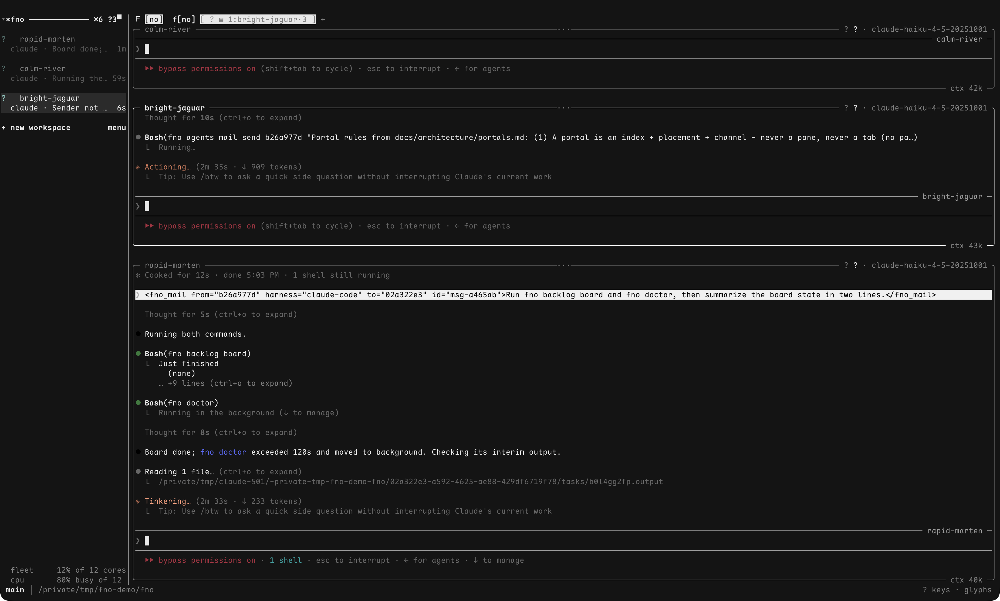

# footnote - f[no]

**Set a target and walk away. Say f[no] to mostly done.**

footnote is an orchestration loop that ships software. It plans, builds, reviews, and opens a green PR, and it does not stop until external truth says so. It runs as a plugin on any harness that accepts plugins and hooks (Claude Code, Codex, OpenCode, and agy are wired today), with a standalone CLI underneath.



- Point it at a feature description or a backlog node. It plans, builds with TDD, reviews its own diff, and ships the PR.
- Completion is decided by the world, not by a model's mood. The PR exists, CI is green, review has had its rounds.
- A dependency-graph backlog keeps the next piece of work ready, so an unattended loop never stalls on "what now?"

## Install

Start with the CLI:

```
curl -fsSL fno.sh | sh
```

When `uv` is missing the script installs it first. The install lands the `fno` CLI with its bundled binaries and adds the tool bin to your PATH. It then wires the plugin into every agent CLI it detects: `claude`, `codex`, `opencode`, `pi`, `agy`, `gemini`. Each harness prints one summary line. Set `FNO_NO_WIRE=1` to skip this step. `fno config setup wizard` wires a harness by hand. The per-harness commands below do it manually. The plugin-only install routes pick up their CLI on the next session.

Claude Code:

```
/plugin marketplace add bllshttng/footnote
/plugin install fno@footnote
```

Codex CLI:

```
codex plugin marketplace add bllshttng/footnote
codex plugin add fno@footnote
```

The plugin-only route gets its CLI on the next session: the first session you start after installing runs the installer. Until then `fno` is not on PATH and the `/fno:` skills cannot run.

CLI only, for scripting, CI, or driving footnote yourself:

```
uv tool install fno
cargo install fno
```

From a clone, `bash scripts/setup.sh` installs the CLI and scaffolds the project. One skill runs without the CLI at all:

```
npx skills add bllshttng/footnote --skill tdd
```

Other harnesses (opencode, agy, gemini, pi): see [docs/HARNESSES.md](docs/HARNESSES.md). Then run `/fno:setup` (or `fno config setup wizard`), and point `/fno:target` at a feature.

## Uninstall

```
fno uninstall --dry-run
fno uninstall
```

The first command lists what it found and changes nothing. The second removes the plugins, the hooks fno added to harness config, the launchd agents and the binaries. It also stops the daemon and the mux. It keeps `~/.fno`. Add `--purge` to delete that too, after you type the confirmation word. Run it from a plain terminal, not from inside an fno mux pane.

## How it works

Named stages, one sentence each:

- **think** explores the design space and writes cited findings before anyone commits to a plan.
- **blueprint** turns the approved direction into an executable plan: waves, tasks, acceptance criteria.
- **target** is the walk-away loop. It executes the plan and will not stop until the PR is up, CI is green, and review is done.
- **review** reads the diff before it ships. An inline lane emits a head-pinned attestation, with `config.review.max_rounds` (default 2) capping the rounds.
- **pr** drives the lifecycle: create, check for external review, and the post-merge ritual.

## What it enforces

The finish line is a PR with CI green and review done under your configured policy. The review round cap releases still-open findings into the PR conversation rather than blocking forever. The merge itself is yours until you opt in to auto-merge. See what can run without you, gate by gate: `fno agents autonomy status`. Not a sandbox: it runs your plans with your credentials on your machine, and [docs/security-posture.md](docs/security-posture.md) draws the trust boundary.

## Docs

- [Getting started](docs/getting-started.md): install, setup, and the commands to run day to day
- [Target pipeline](docs/guides/target.md): the loop's flags, gates, and resume behavior
- [Think and plan](docs/guides/think-and-plan.md): design exploration and planning
- [PR lifecycle](docs/guides/pr-lifecycle.md): review, create, check, merged
- [Agents quickstart](docs/guides/agents-quickstart.md): spawn and message peer agents
- [Vocabulary](docs/architecture/vocabulary-user-and-operator.md): citizen, crown, and the rest of the mesh's words
- [Troubleshooting](docs/troubleshooting.md) and [best practices](docs/best-practices.md)
- [Security posture](docs/security-posture.md)

## Requirements

macOS (Apple Silicon or Intel), Linux (x86_64 / arm64), or Windows via WSL2. Python 3.11+ or uv, `jq`, and `gh` (authenticated).

## License

Apache-2.0, [Jason Noah Choi](https://github.com/bllshttng)
