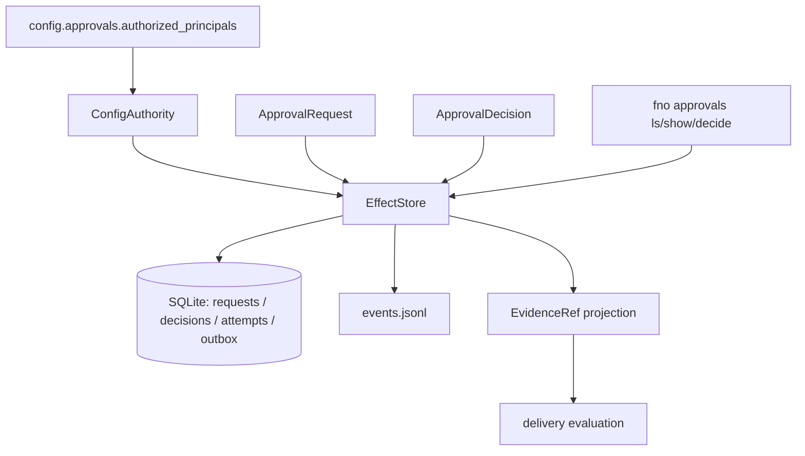

# Approvals and Idempotent Effects

## Overview

An approval binds one exact principal, action digest, destination, effect class, work-order attempt, and expiration.
Nothing less is an approval: changing any bound field produces a different request digest and requires a new decision.

The package owns effect-policy classification, approval requests and decisions, the atomic effect-attempt journal, idempotency lookup, reconciliation state, the hidden operator commands, and the approval and effect lifecycle events.
It does not own who may approve, which is independent project policy, and it does not own work identity or lifecycle, which stay with the graph.
It emits facts that a delivery evaluator consumes; it never declares an aggregate delivery verdict.

## Three separations that the code enforces

Approval is not execution.
Execution is not acknowledgment.
Acknowledgment is not aggregate delivery.

Each is a separate record with its own event, so no consumer can collapse them.
`fno approvals decide --approve` records a decision and dispatches nothing, and its output says so in both human and JSON form.

## Component graph

## Authority

The store consults an injected `Authority` at decision time and again at execution time.
A role, plugin, agent, CLI caller, web surface, chat surface, or transport can carry a decision, but none of them reaches that lookup, so none can add its caller to the authorized set.
The `transport` field on a decision is recorded and never read for authorization.

`ConfigAuthority` reads `config.approvals.authorized_principals`, mapping an effect class to the principal ids allowed to decide it, with the key `*` matching every class.
Absent or empty means nobody may approve.
A fresh install can inspect pending approvals but cannot decide one until a human writes the policy down.

Core policy is function-agnostic: `classify_effect` reads only the effect class.
Financial, signature, employment, and destructive classes are denied outright and listing a principal never overrides that.
Internal drafts and research are inert.
An unrecognised class requires approval rather than sliding through, so a new effect class is safe by default instead of silently exempt.

## The atomic seam

`EffectStore.prepare` is one atomic prepare-or-read keyed by the effect's idempotency key.

SQLite is the backend because the acceptance contract is cross-process mutual exclusion, durable unique keys, and crash recovery.
`BEGIN IMMEDIATE` plus a `UNIQUE` idempotency key supply all three from the standard library; an advisory lockfile would supply none of them.
`UPDATE attempts SET dispatch_claimed = 1 WHERE idempotency_key = ? AND dispatch_claimed = 0` is what makes exactly one concurrent caller the local dispatcher: every other caller reads back the same durable attempt with `may_dispatch=False`.

Reusing one idempotency key for different content, destination, effect class, work order, or attempt is refused with the conflicting fields named.
The refusal names the fields and mutates nothing: the existing attempt is not superseded, redirected, or dispatched.

`cli/tests/integration/test_effect_idempotency.py` proves this across real processes rather than threads, because the exclusion under test is SQLite's cross-process write lock.

## Honest external outcomes

| Outcome | State | Meaning |
|---|---|---|
| Destination acknowledged | `acknowledged` | Terminal and immutable |
| Destination explicitly rejected | `failed` | Terminal for that attempt |
| Missing capability or prerequisite | `blocked` | Refused before dispatch |
| Timeout, connection loss after dispatch, malformed acknowledgment, unavailable reconciliation read | `unknown` | Ambiguous, never guessed either way |

An `unknown` attempt is not blindly redispatched.
`authorize_retry` refuses unless the adapter proves remote idempotency for the same key or a reconciliation read can prove whether the effect already happened.
`AdapterCapability` defaults both to `False`, because absence of a claim is not proof of a capability.

Without either property, Footnote guarantees one local dispatcher and makes no external exactly-once claim.
That limit is deliberate and stated rather than papered over: an ambiguous timeout at a non-idempotent destination can duplicate a public post, a message, a ticket, or a system-of-record mutation.

## Durable state and event repair

Approval and effect state changes commit before their events are emitted, using a transactional outbox.
The state change and the owed event are inserted in the same transaction, so "acknowledged" and "an event is owed" are one atomic fact and a crash cannot land between them.

Emission happens after commit.
If the append fails, the outbox row survives, the store stays authoritative, and `EffectStore.repair()` re-emits from the committed record.
Repair never dispatches, never re-crosses the adapter boundary, and never reopens a terminal attempt for dispatch.

## Events

Three types under source `approvals`: `approval_requested`, `approval_decided`, and `effect_state_changed`.
Every durable transition emits its own event bound to the same work order, attempt, effect, and request digest.

The `decision` and `state` enums in the schema are advisory at the validator layer, matching the `outcome` precedent in the same file: both validators check required fields and envelope shape, not per-type data enums, unless a type opts into a hardcoded check.
Real enforcement is at the only emitter, where `DecisionKind` and `EffectState` are typed enums and an out-of-vocabulary value cannot be constructed.
Promote to a hardcoded check in both validators, with invalid corpus fixtures, if a second untyped emitter ever appears.

## Consuming these facts

`evidence_projection` maps an attempt onto the company-work `EvidenceRef` from [company-work contracts](company-work-contracts.md), so delivery consumes approval and effect facts without importing private approval models and without gaining authority to create or change them.
`passed` there means the destination acknowledged one effect.
It is not a delivery verdict.

## Operator surface

`fno approvals ls|show|decide` is hidden: invocable, not advertised in `fno --help`.

`show` names every bound field, the decision and its transport, the expiration, each effect attempt and its state, and recovery instructions for an ambiguous one.
`ls` and `show` read only.
`decide` returns a stable refusal shape for digest mismatch, unauthorized principal, decline, expiration, replay, conflicting binding, denied class, unsafe retry, and terminal state, each carrying the authority consulted and any recovery step, and exits `ExitCode.ERROR`.

## Deliberately unresolved

Adapter-specific remote idempotency and reconciliation are explicit conformance fields on `AdapterCapability` rather than inferred from a destination type.
No live external adapter ships here; the first one arrives with the delivery node.
