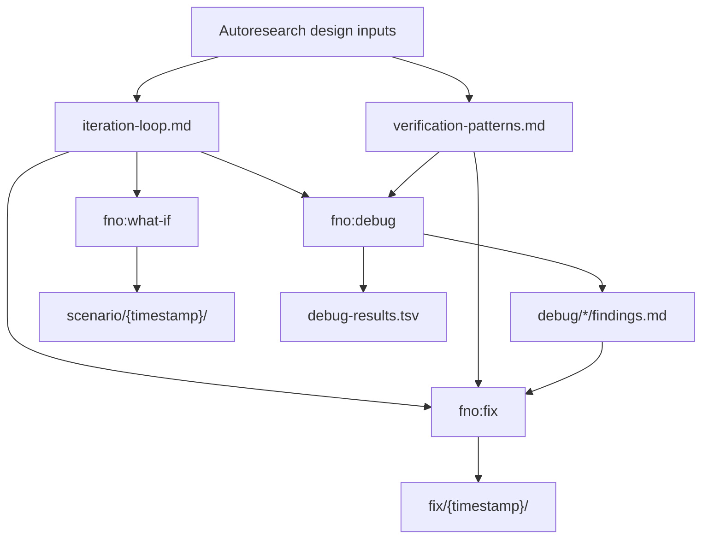

# Autoresearch Incorporation

## Overview

footnote now carries the core bounded-iteration patterns directly instead of depending on a separate autoresearch plugin. The integration adds two new skills, `what-if` and `fix`, and upgrades `debug` to use a scientific-method loop inside the existing BDD-first debugging frame.

## Architecture

## Shared Protocol

The common contract lives in `skills/target/references/iteration-loop.md`.

Every iteration-based skill follows the same sequence:

1. seed the current target
2. do one thing
3. verify mechanically
4. run a guard if needed
5. keep, discard, or rework
6. log the result
7. repeat until the bounded iteration limit is reached

This keeps scenario exploration, debugging, and repair aligned on the same decision model.

## Skill Responsibilities

| Skill | Responsibility | Output |
|------|----------------|--------|
| `fno:what-if` | Generate edge cases and failure modes from one seed scenario at a time | `scenario/{timestamp}/scenarios.md`, `summary.md`, `scenario-results.tsv` |
| `fno:fix` | Reduce build/type/test/lint/debug failures one fix at a time | `fix/{timestamp}/summary.md`, `fix-results.tsv` |
| `fno:debug` | Investigate bugs with acceptance criteria, failing reproduction, hypotheses, and experiments | `.debug/bugs/*`, `debug-results.tsv`, `debug/*/findings.md` |

## Design Decisions

### 1. Pattern extraction, not plugin vendoring

The new footnote skills borrow the loop structure and verification discipline from autoresearch, but they stay in footnote-native SKILL.md form. No separate helper scripts were added for the loop itself.

### 2. Mechanical verification is mandatory

The loop forbids subjective claims like "looks better". Decisions must come from exit codes, error counts, or explicit classification results.

### 3. BDD-first debugging stays intact

`fno:debug` still starts by defining acceptance criteria and a failing reproduction. The scientific-method loop sits inside that frame rather than replacing it.

### 4. Debug and fix are chained, not merged

`debug` is responsible for evidence and findings. `fix` is responsible for repair. The bridge between them is `debug/*/findings.md` plus the `--from-debug` flag.

### 5. Plan validation bugfix was required by the validate gate

The implementation also fixes `scripts/validate-plan.sh` so scaffolding and POC critical-path traces with stub-only lines are correctly classified as warnings. This was needed to make the repo's own validation suite reliable during the target run.

## Files Added or Changed

| File | Role |
|------|------|
| `skills/target/references/iteration-loop.md` | Shared iteration protocol |
| `skills/target/references/verification-patterns.md` | Verification catalog and repo-specific checks |
| `skills/think/what-if.md` | Scenario exploration skill |
| `skills/fix/SKILL.md` | Atomic repair skill |
| `skills/fix/investigate.md` | Scientific-method upgrade with `--fix` chain |
| `scripts/validate-plan.sh` | Semantic stub-detection bugfix |
| `CLAUDE.md` | Skill discovery and iteration-loop documentation |

## Verification

Validated with:

- `bash scripts/doctor.sh`
- `bash scripts/test-validate-plan.sh`
- `bash scripts/test_stop_hook_events.sh`
- `bash scripts/test-scan-antipatterns.sh`
- `git diff --check`
