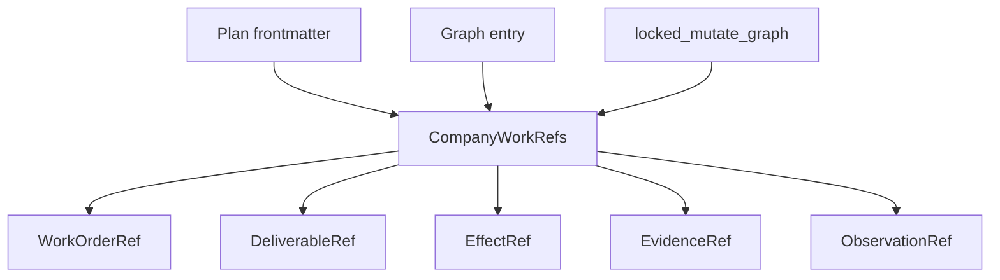
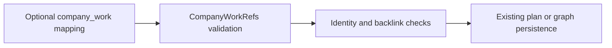

# Company-Work Contracts

## Overview

Company-work contracts are an additive, typed projection that lets a backlog node or plan describe company-oriented execution without changing the graph's lifecycle authority.
The projection models principals, functions, roles, work orders, deliverables, effects, evidence, and observations while remaining agnostic to any particular company function.

## Component Graph



## Data Flow



The graph node ID remains the company work order's durable identity.
`PlanFrontmatter` schema validation, typed graph entry construction, and the locked raw graph persistence seam all validate the same company-work projection.
The persistence check runs before graph bytes are replaced, so an invalid projection leaves the existing graph unchanged.

## Contract Surface

| Contract | Purpose |
|-----------|---------|
| `PrincipalRef` | Identifies the accountable principal. |
| `FunctionRef` | Names a company function without defining function-specific behavior. |
| `RoleRef` | Describes a role that can own work. |
| `WorkOrderRef` | Binds one graph node and attempt to optional principal, function, and role references. |
| `DeliverableRef` | Records an artifact produced by one work-order attempt. |
| `EffectRef` | Records the destination and class of an intended external effect. |
| `EvidenceRef` | Records an honest four-state evidence result: `unknown`, `passed`, `failed`, or `blocked`. |
| `ObservationRef` | References a separate observation node and the metrics it should collect without changing delivery truth. |

All contract models are frozen and reject unknown fields.
Reference collections reject duplicate IDs, dangling references, mismatched work-order attempts, and explicitly contradictory deliverable/effect backlinks.

## Compatibility

The `company_work` field is optional on both `PlanFrontmatter` and graph `Entry`.
Legacy plans and graph nodes therefore parse and behave exactly as before when the field is absent.
Unknown graph fields continue to survive canonicalization, and the new validation does not introduce another state store or lifecycle transition.

## Verification

Run the contract and persistence tests through the repository wrapper:

```bash
fno doctor test cli/tests/unit/company/test_contracts.py cli/tests/unit/test_plan_company_contract.py cli/tests/unit/test_graph_store.py -q
```

The store-level cases are the counterfactual guard: malformed company-work data must raise before the locked writer changes the graph file.

Plans that need a mechanical non-PR finish line can explicitly opt into [generic delivery evidence](generic-delivery-evidence.md).
The runtime evaluator treats these contracts as identity declarations and requires separate current facts for every required evidence slot.
