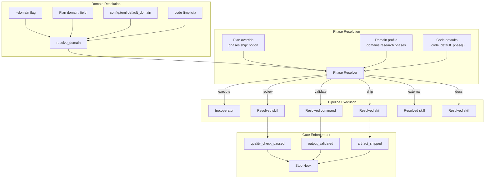

# Domain-Agnostic Pipeline

## Overview

The target pipeline (think → plan → execute → review → validate → ship) is now domain-agnostic. Instead of hardcoded code-specific skills at each phase, the pipeline resolves skills from **domain profiles** defined in config.toml. The `code` domain remains the implicit default — all existing behavior is unchanged.

## Architecture



## Gate Rename Map

| Old Name (code-specific) | New Name (domain-agnostic) |
|---|---|
| `code_review_passed` | `quality_check_passed` |
| `validation_passed` | `output_validated` |
| `pr_created` | `artifact_shipped` |

Gates renamed across 10 files. Stop hook enforcement logic unchanged.

## Resolution Chains

### Domain Resolution

```
--domain CLI flag → plan's domain: field → config.default_domain → "code"
```

First non-empty value wins. Implemented in `resolve_domain()` (config.sh).

### Phase Resolution (per phase)

```
plan-level phases.{name} → domain profile phases.{name} → code default
```

Three-level chain. Plan overrides domain profile overrides code defaults. Implemented via `get_domain_phase()` (config.sh) + plan parsing in SKILL.md.

## Safety Model

### Confirmation Protocol

Skills can declare `confirm: true` in YAML frontmatter. When target resolves to such a skill:

| Mode | Behavior |
|------|----------|
| Interactive (`/target`) | AskUserQuestion before invocation |
| Autonomous (`/target` unattended) | Returns BLOCKED, refuses to invoke |

### allow_claw Enforcement

Domains can set `allow_claw: false` to block autonomous execution entirely:

```yaml
domains:
  trading:
    allow_claw: false  # autonomous target runs refuse to start
```

**Fail-safe design:** When `yq` is unavailable, `domain_allows_claw()` returns deny (not allow) for non-code domains. This prevents `allow_claw: false` from being silently bypassed.

## Config Functions (config.sh)

| Function | Purpose |
|----------|---------|
| `_code_default_phase(phase)` | Returns code domain's default skill for a phase |
| `get_domain_phase(domain, phase)` | Resolves phase skill via domain profile → code default |
| `resolve_domain(flag, plan, settings)` | Resolves domain via lookup chain |
| `domain_allows_claw(domain)` | Checks if autonomous execution is permitted |
| `domain_exists(domain)` | Checks if domain is defined in config.toml |
| `_warn_no_yq_once()` | Shared guard for degraded domain features |

All functions are bash 3.2 compatible (no associative arrays). `yq` is required for non-code domain profiles — without it, functions fall back to code defaults with a warning.

## Files Changed

| File | Role |
|------|------|
| `hooks/target-stop-hook.sh` | Gate enforcement (renamed gates) |
| `hooks/helpers/init-target-state.sh` | State initialization (renamed defaults) |
| `scripts/lib/config.sh` | Domain resolution functions |
| `scripts/metrics/register-task.py` | Task registration (renamed phase map) |
| `scripts/test_stop_hook_events.sh` | Stop hook tests (updated gates) |
| `skills/target/SKILL.md` | Pipeline orchestration (domain resolution + phase invocation, allow_claw check) |
| `skills/target/references/state-schema.md` | State schema (domain fields) |
| `skills/target/references/domain-profiles.md` | Domain profile reference (NEW) |
| `skills/review/references/sigma.md` | Gate name reference |

## Design Spec

