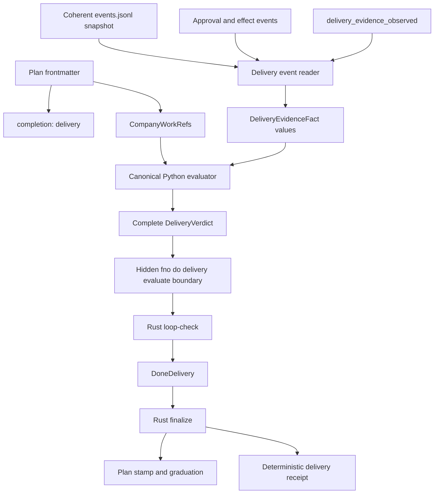
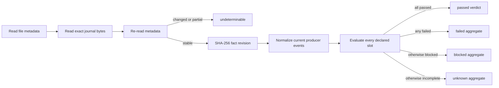

# Generic Delivery Evidence

## Overview

Generic delivery evidence gives an explicitly activated company-work plan one function-agnostic completion path.
It derives a complete, ordered verdict from current runtime facts, then lets the Rust control plane terminate as `DoneDelivery` only when every declared requirement passes.
Existing PR and research sessions keep their exact `DonePRGreen` and `DoneAdvisory` paths.

## Component Graph



## Activation

Generic completion is opt-in.
A plan activates it only with `completion: delivery`, a valid `company_work.work_order`, at least one deliverable, and at least one declared required evidence ID.
`company_work` by itself, a projection-carried `passed` value, an empty requirement list, a process receipt, or a function name does not activate or satisfy the finish line.

```yaml
completion: delivery
company_work:
  work_order: {node_id: x-example, attempt_id: attempt-1}
  deliverables:
    - id: published-output
      kind: arbitrary-output
      work_order_id: x-example
      attempt_id: attempt-1
      required_evidence_ids: [artifact-ready, approval-ready, destination-ack]
```

Plan-carried evidence results declare projection shape only and never establish runtime delivery.

## Evaluation Flow



The evaluator retains one row per declared requirement in declaration order.
Non-passing aggregate precedence is `failed`, then `blocked`, then `unknown`, but precedence never removes the other rows.
Missing, stale, malformed, conflicting, unreadable, future-dated, attempt-mismatched, or mixed-revision facts remain unknown and cannot pass.
Observation subjects are excluded, so later business performance cannot rewrite delivery truth.

## Producer Boundary

Approval and effect lifecycle state remains owned by `fno.approvals`.
Delivery consumes the public `evidence_projection` seam and the documented approval and effect events.
The adapter selects current source events from one coherent snapshot, validates work-order and attempt bindings, and projects facts into uniquely matching required slots.
Current approval and effect events deduplicate on their producer-owned data.event_id; legacy and test events without that optional identity retain the binding-and-timestamp fallback.
It never authorizes a decision, dispatches an effect, mutates the effect journal, or declares aggregate success.

An acknowledged effect may cover separately declared effect and destination-acknowledgment slots for the same effect ID.
`failed` remains failed, `blocked` remains blocked, and `prepared`, `executing`, or `unknown` remain unknown.
An initial prepared transition may omit previous_state because no prior state exists, but delivery never infers execution or acknowledgment from that absence.
A declined approval is a blocked prerequisite rather than evidence that the deliverable failed.

## CLI Contract

The inspection and Rust process boundary is hidden from the curated top-level menu:

```bash
fno do delivery evaluate --json --plan-path path/to/plan.md --events .fno/events.jsonl
```

The response version is `delivery-evaluate-response.v1`, with status `inactive`, `evaluated`, or `undeterminable`.
It carries both the full coherent-journal `fact_revision` and a stable `evidence_revision` derived from the current normalized verdict for this work order and attempt, so loop audit writes, unrelated work, duplicate events, and historical replays do not masquerade as delivery progress.
Rust accepts a pass only from a strict, complete evaluated response whose fact revision matches the verdict and whose non-observation requirement rows all pass with producer and source-revision evidence.
Unknown versions, extra fields, malformed JSON, partial verdicts, and passed observation rows remain nonterminal.

## Terminal and Finalization

Loop-check honors cancellation, budget, abort, and open operator findings before accepting `DoneDelivery`.
It requires nonempty session and graph-node bindings, requires the verdict's work-order node to match the target manifest's graph node, and must durably append the session-bound `delivery_verdict_evaluated` event before returning the terminal decision.
Non-passing generic evaluations and passed evaluations without a promise record loop fires and terminate as `NoProgress` at the normal backstop instead of falling through to a legacy authority.
The generic fingerprint combines normal code/world state with `evidence_revision`, so real producer progress resets that backstop while loop-check audit events do not.
Finalize consumes only the newest target verdict for that session without evaluating again; a newer malformed, incomplete, non-passing, or unbound verdict cannot revive an older pass.

Finalize stamps and graduates the plan when safe, writes a deterministic `fno-delivery://` receipt and generic handoff, and records the normal ledger and run summary.
It does not query GitHub, stamp a PR number, arm auto-merge, assume a merge, or invoke the research evaluator.
Cross-project plans retain the expected-URL-count graduation guard.
A generic finalization failure keeps the stop hook alive for an idempotent retry, while legacy terminal side effects remain best-effort and non-blocking.
The authoritative `DoneDelivery` termination event is appended only after those required generic writes succeed, preventing an active dispatcher from closing the node during a retry.

## Compatibility

Legacy PR and research adapters run as equivalence shadows and do not replace their authorities.
Tests pin pass-versus-continue behavior and the exact `DonePRGreen` and `DoneAdvisory` serializations.

## Verification

```bash
fno doctor test cli/tests/unit/delivery cli/tests/unit/test_plan_company_contract.py cli/tests/events/test_validator_parity.py cli/tests/events/test_schema_manifest.py cli/tests/test_plan_schema_drift.py
cargo test --manifest-path crates/fno-agents/Cargo.toml generic_completion
cargo test --manifest-path crates/fno-agents/Cargo.toml --test finalize_e2e
```

The repository has no root `Cargo.toml`, so root-level `cargo test -p fno-agents` is not valid.

## Failure Recovery

- `inactive` means the plan did not explicitly opt in.
- `undeterminable` means the plan or journal could not be read coherently or validated; fix the named diagnostic and rerun.
- A non-passing verdict names every failed, blocked, or unknown slot; repair the producer-owned fact rather than editing the derived verdict.
- A missing or invalid newest selected-verdict event leaves finalize partial and the stop hook retries after the event log is repaired.
- A missing, unreadable, or session-unbound manifest makes `DoneDelivery` finalize return nonzero for the same retry path; legacy delegated-session behavior stays non-fatal.
- A journal change during evaluation is expected concurrency behavior; rerun after the producer write settles.
