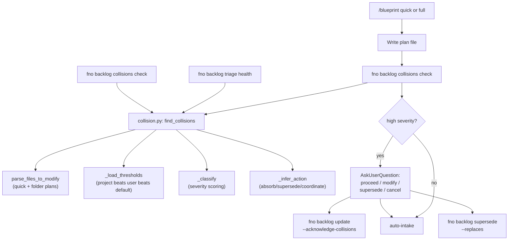

# Graph Collision Detection

## Overview

Graph collision detection catches the failure mode where two specs written
hours apart silently target the same files and surface, and neither plan
author realizes they are stepping on each other until merge time. The fix
is a deterministic file-overlap primitive that three independent surfaces
consume:

1. **`/blueprint`** runs a check between writing the plan and auto-intake.
   High-severity collisions trigger an `AskUserQuestion` flow with four
   resolutions (proceed / modify / supersede / cancel).
2. **`fno backlog triage health`** runs an all-pairs check across the
   pending backlog plus four other "is this backlog healthy?" metrics.
3. **`fno backlog collisions check`** is the direct CLI surface for
   checking a plan against the graph from a script or one-off prompt.

The primitive deliberately scopes to *file overlap* in v1. Concept overlap
(two plans both adding a "status" field without sharing files) requires
either an LLM call or an explicit `topic` tag and gets its own follow-up.
File overlap is mechanical, deterministic, and covers the highest-leverage
failure case at zero runtime cost.

## Architecture



## The collision primitive

`cli/src/fno/graph/collision.py` is pure Python with stdlib-only
dependencies. It exposes:

| Function | Purpose |
|----------|---------|
| `parse_files_to_modify(plan_path)` | Extract file paths from a plan's "Files to Modify" table. Handles single-file quick plans and folder plans (00-INDEX.md plus every NN-* phase file). |
| `find_collisions(candidate, graph, *, self_id, thresholds)` | Compare a candidate plan's file set against every pending plan on the graph. Returns sorted `Collision` records (high severity first). |
| `find_acknowledged_collisions(graph)` | Find nodes whose `collisions_acknowledged` references nodes that have since shipped. Surfaces the "your acknowledged collision is now resolved" reconciliation in triage health. |
| `_load_thresholds(project, user)` | Resolve severity thresholds from layered config. Project beats user beats the v1 defaults baked into `DEFAULT_THRESHOLDS`. |
| `_resolve_plan_path(plan_path, repo_root)` | Resolve absolute, `~`-prefixed, and repo-relative plan paths to an absolute Path. |

`Collision` is a frozen dataclass with `Literal` types for `severity` and
`recommended_action` so the type checker catches typos at the call site
rather than producing surprises at runtime. `CollisionThresholds` is a
`TypedDict` with the four threshold keys; the layered loader returns
this shape so a key-typo in a consumer is a type error, not a `KeyError`.

## Severity scoring

Default thresholds (v1 heuristics; tunable via `settings.yaml`):

| Severity | Trigger |
|----------|---------|
| `high`   | shared file count >= 3 OR (shared / min(set_sizes)) >= 0.5 |
| `medium` | shared file count >= 2 OR (shared / max(set_sizes)) >= 0.25 |
| `low`    | shared count == 1 |

Thresholds live under `config.collision.severity_thresholds` in
`~/.fno/settings.yaml` (or project-local `.fno/settings.yaml`).
The `/setup` wizard's Step 8e exposes them under "advanced" config and
defaults to skip; most users never tune them. After running with defaults
for a few weeks, `fno backlog triage health --json --all` lets you inspect
the real distribution and recalibrate.

## Action inference

Recommended actions are deterministic from set relationships and
plan ages:

| Relationship | Action |
|--------------|--------|
| candidate is a strict subset of other | `absorb` (existing plan covers everything) |
| other is a strict subset of candidate | `supersede` (new plan covers more) |
| shared >= 50% of both sides AND other is older | `absorb` |
| shared >= 50% of both sides AND ages tied | `coordinate` |
| anything else | `coordinate` |

Severity-low cases get a `coordinate` action with a "split into a shared
dependency" rationale appended to the message.

## Audit trail

Three new graph fields, all missing-field tolerant:

| Field | Owner | Purpose |
|-------|-------|---------|
| `collisions_acknowledged: list[str]` | `cmd_update --acknowledge-collisions` | ab-IDs of collisions the user knowingly proceeded past. The sentinel `__skipped_check__` records "I ran with `--no-collision-check`." |
| `superseded_by: str \| None` | `cmd_supersede` | The new node ID that replaced this one. |
| `supersedes: list[str]` | `cmd_supersede` | The old node IDs this node replaces. |

`find_acknowledged_collisions` walks the graph for nodes whose
`collisions_acknowledged` references nodes that have since shipped. Triage
health surfaces these as a "your acknowledged collision is now resolved -
verify the conflict resolved cleanly" line so a deliberately-accepted
conflict gets a closing-the-loop nudge.

## Status derivation

`statuses.py` adds a new `superseded` derived state. Precedence ladder:

```
done > superseded > deferred > blocked > claimed > idea > ready
```

A superseded node never re-surfaces as ready or in `fno backlog next`.
Reactivation requires explicit `unsupersede` (not just `undefer`) because
the user must consciously revive a plan that another plan has already
supplanted. `cmd_supersede` refuses to mutate already-shipped or
already-superseded nodes so the operation is never a destructive write
against ship history; the user opens a follow-up node instead.

## Triage health verb

`fno backlog triage health` returns a structured JSON report:

```json
{
  "scope": "all projects",
  "idea_pile_depth": 1,
  "stale_ready_nodes": [...],
  "failure_prone_nodes": [...],
  "collisions": [...],
  "acknowledged_resolved": [...],
  "totals": { "pending": 33, "ideas": 1, "stale": 0, ... }
}
```

The shape is consumable by downstream tooling: `/loop`, scheduled agents,
dashboards. Future health-style verbs (`fno backlog audit`,
`fno backlog cost-report`) follow the same pattern.

## Performance notes

`find_collisions` resolves repo-relative plan paths against the repo root
via `git rev-parse --show-toplevel`. The result is memoized at module
scope so `triage health` does not spawn N subprocesses for an N-node
backlog. The fallback path (when `git` is missing) emits a one-shot
stderr warning so a misconfigured environment is visible.

## Out of scope (follow-ups)

- **Concept-overlap detection** without shared files (LLM-judged or via
  `topic`/`epic` tags) - separate design loop.
- **Auto-resolution** of low-severity collisions (auto-rebase the
  candidate against the existing plan) - opt-in via a future flag.
- **Cross-project collisions** - today's primitive is project-scoped
  because the graph is project-scoped.
- **Kanban edge rendering** - showing "these two cards have a connecting
  edge" in `~/.fno/graph.md` requires extending the renderer.
- **Time-bounded collision tolerance** - "plans more than 60 days old
  don't count" risks papering over real conflicts; skipped.

## References

- Module: [cli/src/fno/graph/collision.py](../../cli/src/fno/graph/collision.py)
- Tests: [cli/tests/integration/test_collision.py](../../cli/tests/integration/test_collision.py)
- Settings template: [.fno/settings.yaml.example](../../.fno/settings.yaml.example)
- CLI vocabulary: [CLAUDE.md](../../CLAUDE.md) (Backlog Vocabulary section)
- Spec wiring: [skills/blueprint/SKILL.md](../../skills/blueprint/SKILL.md) (Quick step 3a, Full step 11a)
