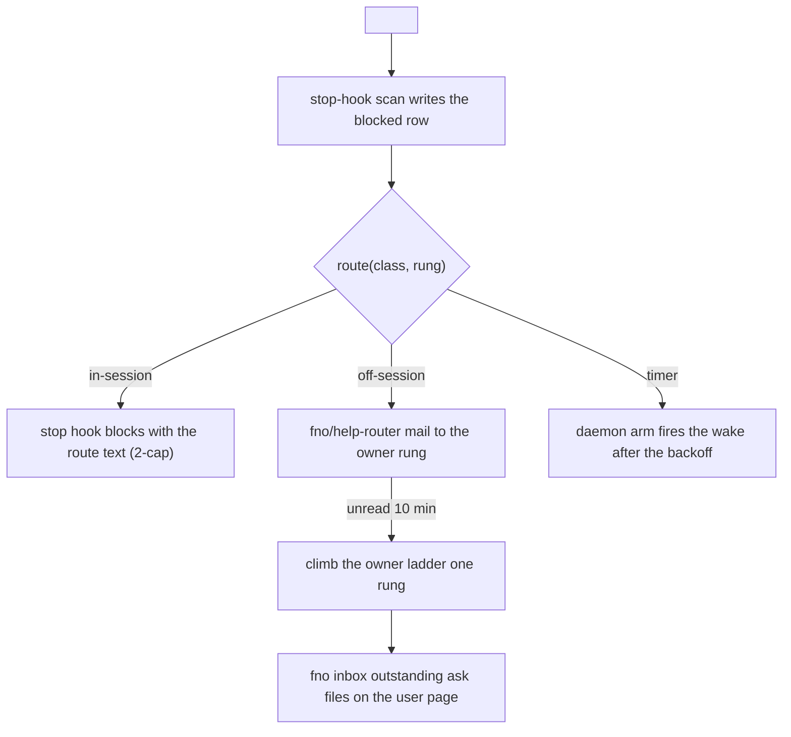

<!-- generated: crates/fno-agents/src/help_router.rs renders this; HELP_ROUTING_BLESS=1 rewrites it. Edits are refused by generated-write-guard. -->

# Help routing

Every `<help class=... reason=... evidence=...>` routes to its next step. The run takes that step in the same session or by mail to the rung that owns it. The chain ends only at a guard that names its owner.

| Class | First route (rung 0) | Escalation |
|---|---|---|
| `stale-plan` | in-session: run the architect pass in place: /fno:blueprint rewrite <plan> | off-session, lead: run the architect pass in place: /fno:blueprint rewrite <plan> The in-session route is spent at rung 2; a lead decides. |
| `missing-prereq` | in-session: file it with fno backlog idea "<prereq>" --wave-of <this node> --difficulty <band>, build it first | off-session, lead: file it with fno backlog idea "<prereq>" --wave-of <this node> --difficulty <band>, build it first The in-session route is spent at rung 2; a lead decides. |
| `ci-red` | in-session: run /fno:fix | off-session, lead: run /fno:fix The in-session route is spent at rung 2; a lead decides. |
| `stuck` | in-session: consult one planner subagent | off-session, lead: consult one planner subagent The in-session route is spent at rung 2; a lead decides. |
| `held` | off-session, node holder: A claim on this node is held while the holder is unreachable (help 0). Mail the holder or release the claim. | off-session, node holder: A claim on this node is held while the holder is unreachable (help 2). Mail the holder or release the claim. |
| `wait` | timer: 300s backoff, 5m/10m/15m cap | timer: 900s backoff, 5m/10m/15m cap |
| `env-denied` | off-session, lead: The run hit an environment or gate refusal it cannot clear (help 0). Evidence carries the receipt. A lead decides. | off-session, lead: The run hit an environment or gate refusal it cannot clear (help 2). Evidence carries the receipt. A lead decides. |
| `gate-deadlock` | off-session, evidence holder: Two gates wait on each other (help 0). The evidence names the holder to break the deadlock. The stop allows as Interrupted. | off-session, evidence holder: Two gates wait on each other (help 2). The evidence names the holder to break the deadlock. The stop allows as Interrupted. |
| `gate-unsatisfiable` | off-session, lead: The run hit an environment or gate refusal it cannot clear (help 0). Evidence carries the receipt. A lead decides. | off-session, lead: The run hit an environment or gate refusal it cannot clear (help 2). Evidence carries the receipt. A lead decides. |
| `question` | off-session, ladder: A session asks a question (help 0). Answer by mail or record a ruling with fno inbox decide. 10 minutes without a read climbs the ladder. | off-session, ladder: A session asks a question (help 2). Answer by mail or record a ruling with fno inbox decide. 10 minutes without a read climbs the ladder. |
| `budget` | timer: 300s backoff, 5m/10m/15m cap | off-session, lead: Budget hit twice in one run (help 2). The evidence names the cap axis and value. A lead re-scopes or raises it. |
| `unclassified` | off-session, lead: An unclassified help (help 0). No route matched. A lead triages it, else it climbs the question ladder. | off-session, lead: An unclassified help (help 2). No route matched. A lead triages it, else it climbs the question ladder. |

## Flow

## Emission rule

Emit the tag, then take the routed step. STOP only for irreversible, money, public surface, or taste. The in-session classes block at most twice per run and class (the third help mails the lead). Question climbs the owner ladder on a 10 minute lease from READ.

## Delivery legs and the lease

Off-session routes deliver through `burn_watch::wake_with_text`: mail from `fno/help-router` first. A durable receipt triggers the resume fallback. The route row records the leg that landed (queued, handed). The lease runs from READ, proven in the recipient transcript at the sweep. A delivery that hands and is never read climbs one rung after 10 minutes, ending on the user page (`fno inbox outstanding ask`).
