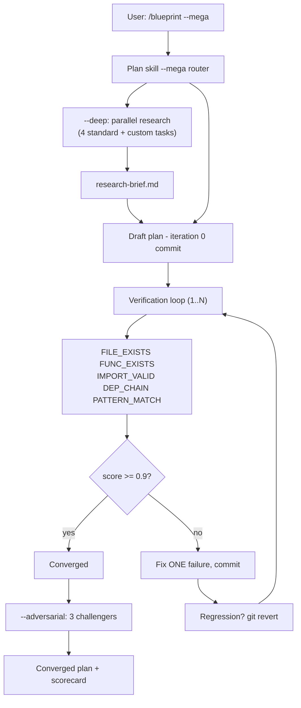

# Megaplan

## Overview

`megaspec` adds iterative plan refinement to the footnote pipeline. It drafts a plan, runs mechanical verification checks against the actual codebase, fixes one failure per iteration, and commits progress until the quality score converges.

Invoked via `/blueprint --mega "feature"`.

## Architecture

## Verification Engine

`skills/megaspec/references/verification-engine.md` - five check types:

| Check | Verifies |
|-------|---------|
| `FILE_EXISTS` | Plan references only files that exist |
| `FUNC_EXISTS` | Referenced functions and types are present |
| `IMPORT_VALID` | Assumed import paths resolve |
| `DEP_CHAIN` | Phase dependencies are correctly ordered |
| `PATTERN_MATCH` | Proposed changes follow codebase conventions |

Quality score = fraction of checks that pass. Threshold: 0.9.

## Iteration Loop

`skills/megaspec/references/iteration-loop.md` - adapted from `skills/target/references/iteration-loop.md`:

1. Draft plan, commit `megaspec(draft): iteration 0`
2. Run checks, compute score; if >= 0.9 exit
3. Fix ONE failing check, commit
4. Score regressed? `git revert`, try different fix
5. Repeat up to bound (default 5, max 10)

## Modes

**--deep**: Parallel research fan-out before first draft - pattern survey, dependency map, test infrastructure, risk identification, plus 1-2 custom tasks. Outputs `research-brief.md` to seed the draft.

**--adversarial**: Three challengers after convergence - Dependency Pessimist (stale refs), Scope Creep Detector (hidden deps), Execution Realist (ambiguous instructions). Each may trigger additional iterations.

## Integration Points

- **Plan skill**: detects `--mega`, routes before writing the plan file
- **Index template**: adds verification report section to generated `00-INDEX.md`
- **Config schema**: `megaspec.iteration_limit`, `megaspec.score_threshold`, `megaspec.log_destination`
- **Setup wizard**: log destination step when megaspec preferences are configured

## Design Decisions

**One fix per iteration** - keeps the commit log readable; regressions are easy to isolate.

**Git as safety net** - score regression triggers `git revert`, reusing the same rollback primitive as `fno:fix`.

**Score threshold over iteration count** - exits on quality, not exhausted iterations. Hitting the bound signals that human review is needed.

**Challengers after convergence** - adversarial review is a second pass so the loop isn't fighting two competing signals at once.
