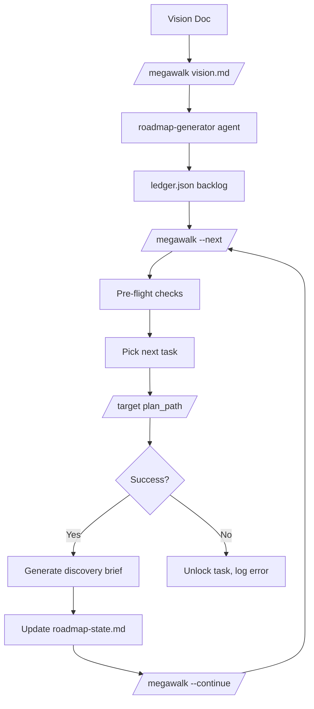
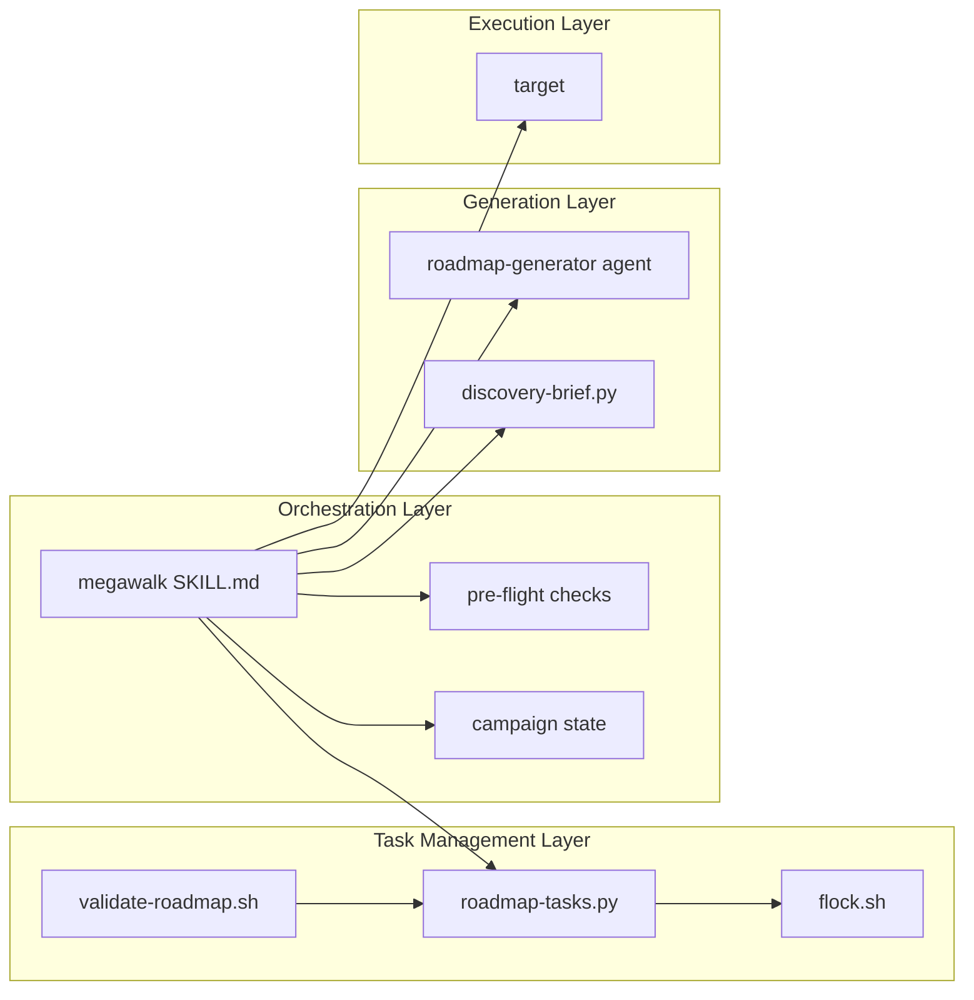
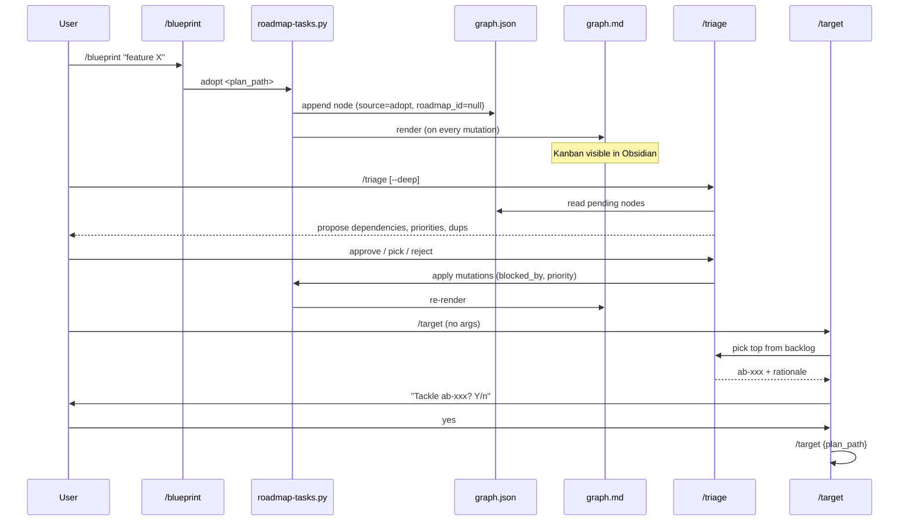
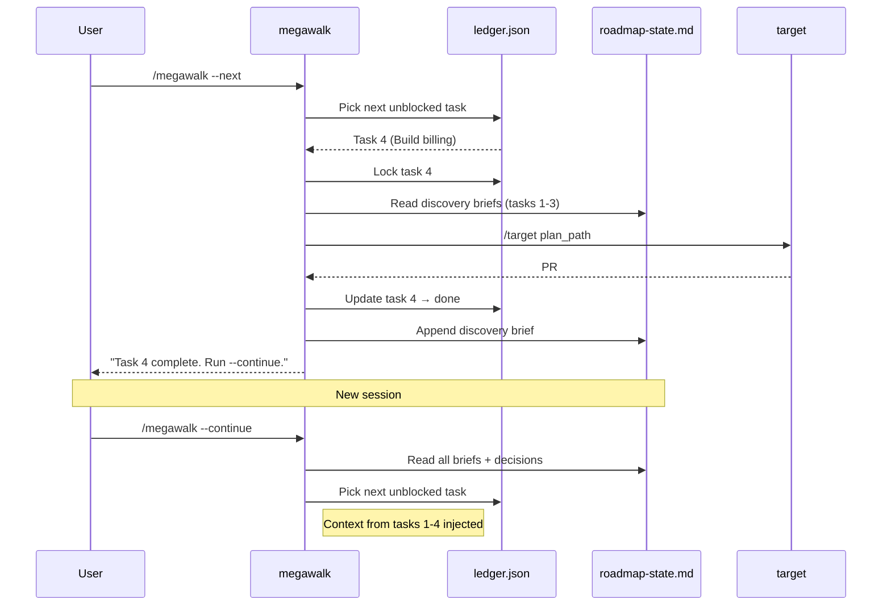

# Do-Roadmap: Multi-Session Task Orchestration

> Architecture doc for the megawalk skill - vision-to-backlog generation, one-task-per-session execution, and cross-task discovery relay.

## Overview

Megawalk extends the footnote plugin from single-feature execution (target) to multi-feature product delivery. It takes a vision document, generates a prioritized task backlog, and executes tasks one at a time across sessions, bridging context via campaign persistence and discovery briefs.



## Key Constraint

**Do-target stays untouched.** The existing `/blueprint --full` then `/target path/to/plan` workflow is the optimal single-feature path. Megawalk is purely additive - a composition layer that chains multiple target runs.

## Component Architecture



### Task Management (`roadmap-tasks.py`)

Central CRUD interface for the task backlog. All mutations use `locked_mutate()` which wraps the entire read-modify-write cycle in an `fcntl.flock` + `tempfile.mkstemp` → `os.replace` atomic write.

| Command | Purpose |
|---------|---------|
| `read` | Query tasks with status/roadmap-id filters |
| `add` | Create task with auto-incremented ID |
| `adopt` | Promote an ad-hoc `/blueprint` plan from ledger.json into a roadmap |
| `update` | Modify specific fields on a task |
| `next` | Find highest-priority unblocked task |
| `validate` | Cycle detection, dangling refs, scope heuristic |
| `cost` | Record per-session cost attribution |
| `remove` | Delete with cascade warning |
| `defer` | Defer with dependent-blocking warning |
| `archive` | Move done tasks to archive file |

### Ledger vs Graph Separation

`~/.fno/ledger.json` is the execution + planning history registry (owner: target). `~/.fno/graph.json` is the forward-looking graph of planned, ready, in-progress, and completed feature nodes - shared by `megawalk next` (which filters by `roadmap_id`) and any individual `/target <plan_path>` invocation (which just reads the plan). They are intentionally separate files: ledger records what happened, graph records what's planned or claimed.

`adopt` bridges them without duplicating data. It has two modes:

- **Backlog mode** (no `--roadmap-id`): node created with `roadmap_id=null`. Visible to anyone scanning the graph but not routed by `megawalk next`. Intended for ad-hoc specs you want tracked but haven't committed to a specific roadmap.
- **Roadmap mode** (`--roadmap-id <id>`): node tagged to that roadmap so `megawalk next --roadmap-id <id>` picks it up in ordering.

In both modes the ad-hoc plan's row in `ledger.json` stays as planning-cost history, and `adopt` only appends a new node to `graph.json` linked by `plan_path`. Nodes carry a `source: "adopt"` tag to distinguish them from roadmap-generator output.

## Backlog Lifecycle (Adopt → Render → Triage → Pick)

Ad-hoc specs flow through the graph in four stages. `/blueprint` now auto-adopts on save, `locked_mutate_graph()` renders `graph.md` on every write, `/triage` proposes an ordering via LLM, and `/target` pulls the top node from the backlog when invoked with no arguments.



Key properties:

- **One writer, many readers.** `roadmap-tasks.py` is the only writer of `graph.json`. `graph.md` and any other derived views are produced inside `locked_mutate_graph()` so they can never disagree with the JSON source of truth.
- **`graph.md` is always current.** Every mutation triggers a re-render post-write. A render failure logs to stderr but does not raise - graph.json has already been durably written by the time the render runs.
- **Triage is advisory, not automatic.** The LLM proposes; the human approves, cherry-picks, or rejects. Priority is a business decision, never auto-applied.
- **Backlog and roadmaps coexist.** A node with `roadmap_id=null` is on the general backlog; a node with `roadmap_id=rm-X` is tagged to a roadmap. Both appear on the same kanban; `megawalk next` filters by roadmap_id, `/target` picks from either.
- **No schema changes.** The kanban columns and triage proposals read existing graph fields; no migration needed.

### Schema Evolution

ledger.json evolves from a flat completion registry (638 existing entries) to a lifecycle-aware backlog. Backward compatibility via lazy migration - old entries default to `status: "done"` on read without modifying the file.

New fields: `status`, `dependencies`, `priority`, `domain`, `locked_by`, `locked_at`, `roadmap_id`, `vision_path`, `discovery_brief`, `cost_sessions`, `details`.

### Dependency Resolution

Uses Kahn's algorithm (topological sort) for cycle detection. The `next` command filters tasks where all dependencies have `status: "done"`, then sorts by priority (high > medium > low) and ID.

Stale lock detection auto-unlocks tasks locked for >2 hours (configurable via `TASK_LOCK_TTL_HOURS`).

## Session Model



**One task per invocation.** Do-target runs burn significant quota. The "loop" happens when the user runs `--continue` in the next session. Campaign state in `roadmap-state.md` ensures continuity.

## Discovery Relay

Borrowed from Citadel's discovery relay pattern. After each task completes:

1. `discovery-brief.py` reads HANDOFF.md + git history
2. Compresses to ~500-token brief (goal, key files, decisions, verify commands)
3. Stores in ledger.json (`discovery_brief` field) and roadmap-state.md

Before each task starts, all prior briefs + decision log load as context. This prevents stale execution - task 4 knows what tasks 1-3 built, what files they created, and what architectural decisions they made.

## Pre-Flight Checks

Run before every `--next` or `--continue`:

| Check | Severity | Purpose |
|-------|----------|---------|
| Clean working tree | FAIL | Prevent merge conflicts |
| Git auth valid | FAIL | Prevent silent PR creation failure |
| Budget remaining | FAIL | Prevent cost overrun |
| Stale locks | WARN | Auto-clean orphaned locks |
| Plan freshness | WARN/CRITICAL | Detect drift from prior task changes |
| Prior PR health | WARN | Verify completed task PRs still open/merged |

## Design Patterns

| Pattern | Source | Usage |
|---------|--------|-------|
| Campaign persistence | Citadel (Archon) | Session bridging via state files |
| Discovery relay | Citadel | Compressed knowledge between waves |
| Pre-flight + verify+guard | Autoresearch | Validate before spending tokens |
| Atomic operations | Autoresearch | flock + mkstemp → os.replace |
| Git-as-memory | Autoresearch | `git log` + `git diff` for context |
| Amnesiac sessions | Citadel | Rebuild context from files, not memory |

---

## Walker Rebuild (2026-04-29)

The shell-driven `--next`/`--continue` loop above is the v1 design. v2 replaces it with a Python walker (`fno megawalk`) that subprocesses `fno loop` per node so exit-42 is a clean handoff and adds parallel, dependency-aware scheduling. The `/megawalk` skill body is now a thin wrapper that invokes the walker via the Skill tool.

### State Machine

```
IDLE -> LOOPING -> COMPLETE
         |-> PAUSED -> (resume) -> LOOPING
         |-> BLOCKED (priority-aware: p0 -> PAUSED, others -> skip + BLOCKED)
```

The state is `LOOPING | PAUSED | COMPLETE | BLOCKED` (per `cli/src/fno/schemas/megawalk.py`). Megawalk's stop hook treats `LOOPING` as keep-alive and any other status as exit signal.

### Walker Loop (per iteration)

```
read graph.json (hash-validated via .sha256 sidecar)
  |-> if mismatch -> PAUSED with reconcile hint, exit
select_ready_nodes(parallel_cap, deps_satisfied, priority p0..p3)
  |-> for each: WorktreeManager.create() -> ThreadPoolExecutor.submit(_drive_node)
poll futures (FIRST_COMPLETED, POLL_INTERVAL_S)
  |-> done -> _handle_node_result -> mark done/blocked, possibly pause
  |-> stuck (WorktreeManager.is_stuck=True) -> _handle_stuck_node -> PAUSED
  |-> none -> check pause sentinel + budget cap
process_pending_merges (auto_merge_gate; stale-approval pinning to head SHA)
exit when futures empty AND no remaining selectable nodes
```

Per-node `_drive_node` invokes the host helper (`run_host_step`) which subprocesses `fno loop` and round-trips exit-42 via the Driver protocol (claude-code, hermes, openclaw, fallback).

### Hardening Primitives

| Primitive | Module | Role |
|-----------|--------|------|
| Hash sidecar (`graph.json.sha256`) | `cli/src/fno/graph/load.py` | Detects direct edits; raises `GraphCorruptionError` with `fno backlog rehash` hint |
| PreToolUse hook (`hooks/graph-write-protect.sh`) | hooks/ | Blocks Edit/Write on `~/.fno/graph.json` end-to-end (test fixtures bypassed) |
| HARD-GATE blocks (megawalk SKILL.md) | skills/ | LLM-side guard against direct mutation |
| PID lock (`_acquire_pid_lock`) | megawalk.py | Prevents concurrent walker processes; reclaims stale locks |
| Stale-approval pinning | `_check_review_approval` | Approves only if PR head SHA matches the approved review SHA |
| GH rate-limit shared state | `_parse_gh_rate_limit_headers` | Throttles when `X-RateLimit-Remaining` < 50 |
| Driver protocol fallback | removed | The Python driver tier (`megawalk_drivers/`) was deleted as dead code; the Rust unified-loop runtime owns driver dispatch (see `docs/architecture/path-census.md`, spawn census) |

### Graceful Pause + Resume

`fno megawalk pause` writes a `.megawalk-pause` sentinel that the walker honors at every loop boundary. If the walker doesn't exit within `timeout_s` (default 300s), `do_pause` escalates to SIGTERM on the recorded pid. `fno megawalk resume` clears the sentinel, reconciles `in_flight_nodes` against worktree existence (missing worktree -> mark blocked), and flips status to LOOPING.

### Auto-Redispatch on Walker Startup

After `do_resume` flips status to LOOPING, the next `run_walker` invocation runs a reconcile pass before its main selection loop. The pass iterates `state.in_flight_nodes`: for every entry whose `worktree_path` exists on disk, it constructs a `Worktree` value object pointing at the existing path and submits a `_drive_node` future against it. The pass populates the same `futures` dict the main loop polls, so orphan completion flows through the standard `_handle_node_result` path (no special-case handling on the success or failure branch).

`worktree_manager.create()` is NOT called for redispatched orphans - the worktree already exists on disk and the reconstruction reads its branch name from the `feature/{node_id[-8:]}` naming convention. Future improvements may swap the inline reconstruction for a `WorktreeManager.attach()` factory that reads the real branch from `git worktree list --porcelain` (tracked as a follow-up); the current implementation is sufficient because `_drive_node` does not depend on `worktree.branch`.

Defensive behavior: in-flight entries with missing `worktree_path`, missing graph entries, or worktrees that vanished between `do_resume` and walker start emit `reconcile_skip` events to `events.jsonl` and are not redispatched. Successful redispatches emit `reconcile_redispatch` events with the orphan's node id and worktree path.

### Test Coverage (phase 06)

`cli/tests/integration/`:

| File | Tests | AC |
|------|-------|----|
| `test_e2e_walker_happy.py` | walker drives 2 ready nodes to COMPLETE | AC1-HP |
| `test_e2e_stuck.py` | stuck-handler unit + walker-loop integration | AC4-FR (fast variant); AC4-FR-wallclock deferred (infra: needs nightly CI 25min budget) |
| `test_e2e_graph_corruption.py` | tampered sidecar -> PAUSED with reconcile hint | AC5-FR-graph |
| `test_e2e_hook_block.py` | PreToolUse hook payload contract | AC5-EDGE-graph (synthesized payloads); AC5-EDGE-graph-dynamic deferred (infra: needs nightly CI with claude --print + API access) |
| `test_e2e_resume.py` | reconcile in-flight on resume | AC1-FR |
| `test_e2e_pause_timeout.py` | sentinel + SIGTERM escalation | AC3-ERR |
| `test_e2e_parallel_deps.py` | concurrency barrier + dependency ordering | AC2-HP, AC2-EDGE |
| `test_e2e_skill_rewrite.py` | thin-wrapper SKILL.md invariants | phase-05 ACs |

Slow integration tests are tagged `@pytest.mark.slow_e2e`; the 30-minute real-time stuck variant uses `slow_e2e_25min` and is excluded from per-PR CI by default.

### Migration from Shell Loop

Users invoking the previous shell-driven megawalk (`/megawalk --next` / `--continue`) need no migration: the bare `/megawalk` form continues to work and now dispatches to the walker. The CLI surface adds `fno megawalk` for headless invocation (cron, CI, scripts) - see [megawalk-migration.md](../../megawalk-migration.md) for the surface-change history.
