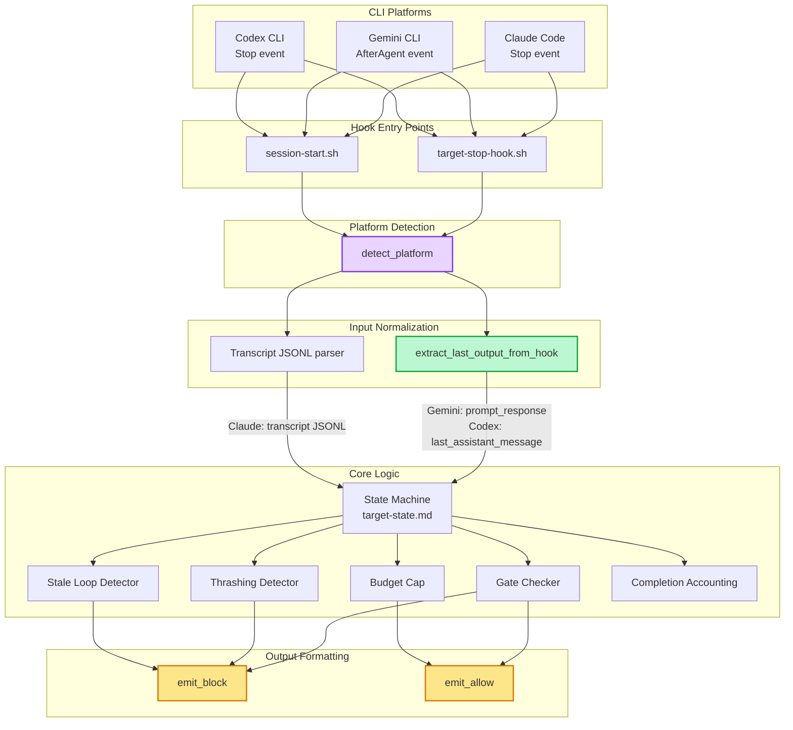
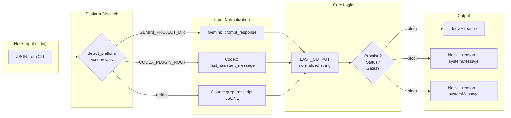
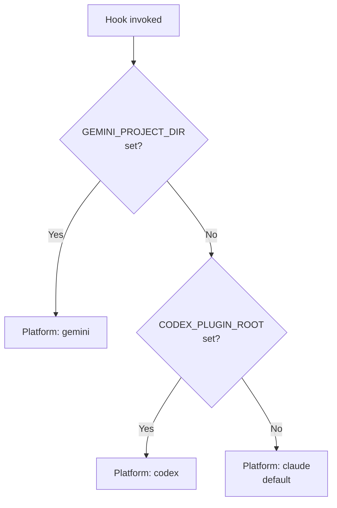

# Multi-CLI Hook Integration

## Overview

footnote' stop hook (target loop) and session-start hooks support Claude Code, Gemini CLI, and Codex CLI as lifecycle enhancers. The static per-provider capability matrix that previously declared hook/subagent/custom-agent/parallel-dispatch support was removed (multi-CLI adapters superseded by hooks); provider behavior is now hook-driven. The hooks layer handles session hydration, stop-gate enforcement, and accounting directly.

## Component Graph



## Data Flow



## Platform Detection



## New Components

| Component | Location | Purpose |
|-----------|----------|---------|
| `detect_platform()` | `hooks/target-stop-hook.sh` | Runtime platform detection via env vars |
| `extract_last_output_from_hook()` | `hooks/target-stop-hook.sh` | Platform-aware last output extraction |
| `emit_block()` | `hooks/target-stop-hook.sh` | Platform-specific block/deny output |
| `emit_allow()` | `hooks/target-stop-hook.sh` | Platform-specific allow output |
| `session-start.sh` | `hooks/session-start.sh` | Cross-platform SessionStart wrapper |
| `hooks-gemini.json` | `hooks/hooks-gemini.json` | Gemini CLI hook configuration |
| `hooks-codex.json` | `hooks/hooks-codex.json` | Codex CLI hook configuration |
| `gemini-extension.json` | repo root | Gemini CLI extension manifest |
| `.codex-plugin/plugin.json` | repo root | Codex CLI plugin manifest |
| `GEMINI.md` | repo root | Gemini CLI context file |
| `AGENTS.md` | repo root | Codex CLI context file |
| `cli-tool-mapping.md` | `skills/target/references/` | Cross-platform tool equivalents reference |

## Modified Components

| Component | Change |
|-----------|--------|
| `target-stop-hook.sh` | Added platform detection, input normalization, output formatting. Replaced 7 raw `jq` decision calls with `emit_block`/`emit_allow`. Made `transcript_path` guard platform-aware. |
| `target/SKILL.md` | Added cli-tool-mapping reference line |
| `operator/SKILL.md` | Added cli-tool-mapping reference line |
| `do/SKILL.md` | Added cli-tool-mapping reference line |
| `CLAUDE.md` | Added Multi-CLI Support section |
| `README.md` | Added CLI compatibility matrix and per-CLI install instructions |

## Platform API Differences

| Aspect | Claude Code | Gemini CLI | Codex CLI |
|--------|------------|------------|-----------|
| **Hook event** | `Stop` | `AfterAgent` | `Stop` |
| **Last output source** | Transcript JSONL (grep) | `prompt_response` in hook input | `last_assistant_message` in hook input |
| **Block decision** | `{"decision":"block","reason":"...","systemMessage":"..."}` | `{"decision":"deny","reason":"..."}` | `{"decision":"block","reason":"...","systemMessage":"..."}` |
| **Allow decision** | No output, or `{"decision":"allow","systemMessage":"..."}` | `{"decision":"allow"}` | No output |
| **Platform env var** | `CLAUDE_PLUGIN_ROOT` | `GEMINI_PROJECT_DIR` | `CODEX_PLUGIN_ROOT` |
| **Instructions file** | `CLAUDE.md` | `GEMINI.md` | `AGENTS.md` |
| **Plugin manifest** | `.claude-plugin/plugin.json` | `gemini-extension.json` | `.codex-plugin/plugin.json` |
| **Skill invocation** | `Skill` tool | `activate_skill` tool | `$skill-name` auto-loading |
| **Subagent dispatch** | `Agent` tool | Stable: sequential fallback. Experimental: project agents in `.gemini/agents/*.md` when opted in and enabled | Project-scoped custom agents (`.codex/agents/*.toml`) |

## Architecture Decisions

### Why runtime detection over build-time transformation?

The get-shit-done project uses install-time transformation (4,479-line installer that converts content per platform). We chose runtime detection because:

1. **Simpler** — No build tooling, no installer maintenance
2. **Single source of truth** — One script, not N platform copies
3. **Immediate feedback** — Changes work on all platforms without rebuild
4. **Trade-off** — Slightly more runtime branching, but the branches are small (~5 lines each)

### Why wrapper for session-start instead of modifying existing hooks?

`inject-project-vision.sh` outputs Claude Code-specific JSON (`hookSpecificOutput`). Rather than modifying it (breaking existing Claude Code behavior), `session-start.sh` wraps it and re-formats output per platform. This preserves backward compatibility.

**SessionStart output contract (current).** Claude Code, Gemini CLI, and Codex CLI have all converged on the same SessionStart hook output: `{"hookSpecificOutput": {"hookEventName": "SessionStart", "additionalContext": "..."}}` (camelCase). Verified against Gemini's hook reference and Codex's `SessionStartHookSpecificOutputWire` schema. `session-start.sh` emits this shape for all three; the earlier non-Claude `additional_context` (snake_case) branch was stale and is retained only for Cursor/generic. Claude Code wires the individual SessionStart sub-hooks via the plugin manifest; Gemini and Codex wire this single `session-start.sh` wrapper into user-level config (`~/.gemini/settings.json` and `~/.codex/config.toml`) via `fno setup cli-hooks`. Codex additionally requires the user to trust the hook before it runs.

### Why `transcript_path` guard is platform-aware

Gemini/Codex provide the last assistant message directly in hook input — they may not provide `transcript_path` at all. Making the guard Claude-only prevents the hook from exiting early on platforms that don't need transcripts.

## Graceful Degradation

| Feature | Claude Code | Gemini/Codex |
|---------|------------|--------------|
| Autonomous looping (stop hook) | Full | Full when hooks are configured |
| Parallel subagent waves | Full (Agent tool) | Codex: full via custom agents, Gemini: stable sequential fallback with optional experimental project-agent upgrade |
| Cost tracking | Full (transcript parsing) | Partial (may lack transcript) |
| Planning session detection | Full (transcript scan) | Not available (Claude JSONL format) |
| Orphan session detection | Full (transcript scan) | Not available |
| `systemMessage` on allow | Supported | Lost (informational only) |

## Security

- No secrets or credentials in hook scripts
- Platform detection uses only environment variable presence (not values)
- Hook input is parsed with `jq` with `// empty` fallback (prevents injection)
- All shell variables properly quoted

## Known Limitations

1. **Planning session auto-detection** doesn't work on Gemini/Codex (transcript format is Claude-specific)
2. **Orphan session detection** only works on Claude Code transcript format
3. **Platform detection inconsistency** between `target-stop-hook.sh` (3 platforms) and `session-start.sh` (4 platforms including Cursor) still needs cleanup
4. **Codex custom agents must be generated** before parity behavior is available: `python3 scripts/sync-codex-agents.py --write`
5. **Gemini project-agent mode is experimental** and also depends on Gemini CLI enabling experimental agents in the client settings; the repo can only verify local opt-in and generated artifacts
6. **Inline Python with interpolated shell vars** (planning session title extraction, line 462) could break on paths with special characters

## Validation

Run these checks after changing the Codex adapter or hook surface:

```bash
python3 scripts/sync-codex-agents.py --check
python3 scripts/sync-gemini-agents.py --check
bash scripts/test-sync-codex-agents.sh
bash scripts/test-sync-gemini-agents.sh
bash scripts/test-parallel-wave-conflicts.sh
bash scripts/test_stop_hook_events.sh
bash scripts/test-target-state-recovery.sh
```
