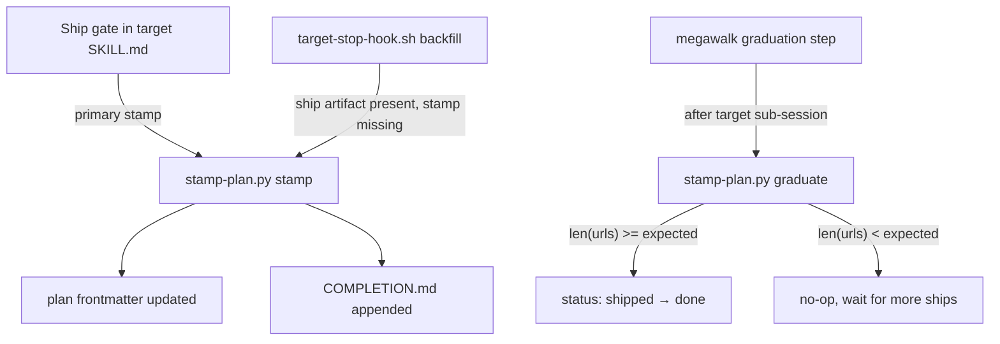

# Plan Completion Stamp

## Overview

The plan completion stamp makes shipped plans self-describing. When `/target`
finishes its ship gate, it writes structured metadata directly into the plan's
YAML frontmatter and appends a prose completion log alongside. A reviewer
browsing the plans folder can tell at a glance whether a plan shipped, when,
and where the PR lives - without consulting `ledger.json`, `git log`, or
any external registry.

Before this feature, a plan file looked identical whether it had been shipped
last week or was still sitting in the backlog. The only way to answer "did
this ship?" was to cross-reference `~/.fno/ledger.json` by `plan_path`
or grep git history for a PR that touched the same files. Both paths required
context outside the plan itself and were invisible to Obsidian-based browsing.

## Schema

The stamp lives in the plan's YAML frontmatter. For folder plans the target
file is `00-INDEX.md`; for single-file quick plans it is the plan file itself.

```yaml
---
status: shipped         # or "done" after graduation
shipped_at: 2026-04-22T14:31:05Z
urls: [https://github.com/org/repo/pull/42]
session_ids: [abc123]
expected_url_count: 1   # cross-project plans set this to the project count
---
```

The parser (`scripts/lib/stamp-plan.py`) is inline-only by design: it handles
scalar values and flat `key: [v1, v2]` inline lists. Block-list syntax
(`- item`) is rejected with a clear error so callers see parse failures
rather than silent data loss. Inline list syntax is intentional and must be
preserved when showing examples or writing tests.

See `CLAUDE.md` under "Plan Completion Stamp" for the canonical field
definitions. This document goes deeper on the runtime behavior.

## `shipped` vs `done`

Two distinct terminal states exist because cross-project plans can ship their
PRs incrementally.

| Status | Meaning |
|--------|---------|
| `shipped` | At least one PR URL is stamped; may still await more URLs |
| `done` | All expected URLs are present (`len(urls) >= expected_url_count`) |

For single-project plans, `expected_url_count` is 1. The first stamp sets
`status: shipped` and the immediate `graduate` call flips it to `done` in the
same session, so single-project plans reach `done` without a gap.

For cross-project plans, each sub-repo's target session stamps its own URL.
The plan stays `shipped` until every repo has contributed a URL. The final
session's `graduate` call sees `len(urls) >= expected_url_count` and flips
to `done`. Between the first and last sub-repo ships, the plan is genuinely
`shipped` - real code is in review, just not everywhere yet.

## Invocation Points

Three call sites write stamps. Each has a different role:



### 1. Ship gate (primary)

After the ship artifact is written and `ledger.json` / `graph.json` are
updated, the target skill invokes:

```bash
python3 "${REPO_ROOT}/scripts/lib/stamp-plan.py" stamp \
  --plan-path "$PLAN_PATH" \
  --session-id "$SESSION_ID" \
  --url "$PR_URL" \
  --expected-url-count "$EXPECTED_URL_COUNT" \
  --completion-note "$(cat .fno/artifacts/ship-${SESSION_ID}.md)"
```

Stamp failure here is non-fatal. The graph and ledger writes are already
committed by the time stamp runs, so the plan is recoverable via the
stop-hook backfill or a manual invocation.

### 2. Megawalk graduation

After each target sub-session completes, megawalk runs the graduate step:

```bash
python3 "${REPO_ROOT}/scripts/lib/stamp-plan.py" graduate \
  --plan-path "$PLAN_PATH"
```

`graduate` is conditional: it reads `expected_url_count` from the frontmatter,
counts the current `urls` list, and only flips `shipped` to `done` when the
count is met. On intermediate ships of a cross-project plan it exits 0 without
touching the file. See `skills/megawalk/references/bare-loop-execution.md`
step 7b (graduation step) for the surrounding protocol, including the
graph.json sync that follows a `done` transition.

### 3. Stop-hook backfill

`hooks/target-stop-hook.sh` runs at every session boundary. After a successful
session it checks whether the ship artifact is present but the plan frontmatter
lacks the current session ID. If both conditions hold, it calls `stamp-plan.py
stamp` with the `pr_url` from `target-state.md`. This catches the case where
the primary stamp failed or was skipped (e.g. context pressure forced an early
exit).

Backfill is also non-fatal. The hook logs the outcome to
`.fno/target-stop-hook.log` and proceeds with artifact archival regardless.

## Idempotency Guarantees

The stamp operation is designed to be re-runnable without side effects:

- If `(session_id, urls)` are both already present in frontmatter, the script
  exits 0 without writing anything.
- `shipped_at` is only set on the first stamp and is never overwritten on
  re-runs.
- `urls` and `session_ids` are deduplicated before writing; appending the same
  URL twice produces one entry.
- `graduate` exits 0 without writing if `status` is not already `shipped`.

These guarantees make all three call sites safe to overlap - if the ship gate
stamps, then the stop-hook backfill fires, and then a manual re-run happens,
the frontmatter ends up identical to what the first stamp wrote.

## Atomic Writes

`scripts/lib/stamp-plan.py` uses a `mkstemp` + `os.replace` pattern for all
file writes:

1. Snapshot the target file's mode (`0o644` is typical).
2. Create a tmp file in the same directory via `tempfile.mkstemp`.
3. Write the full updated content to the tmp file.
4. `os.chmod(tmp, original_mode)` - restore original permissions.
5. `os.replace(tmp, target)` - atomic rename on POSIX systems.

On error, the tmp file is unlinked and the original is unchanged. This applies
to both the plan frontmatter update and the `COMPLETION.md` append. Because
`os.replace` is atomic at the filesystem level, a crash mid-write leaves the
original file intact rather than a truncated partial write.

The same pattern is used by `roadmap-tasks.py` for `graph.json` mutations.
See `megawalk-pipeline.md` for context on the broader write discipline.

## COMPLETION.md

For folder plans, each `stamp` invocation appends a section to
`{plan_dir}/COMPLETION.md`:

```markdown
# Completion Notes

## Ship 1 - 2026-04-22T14:31:05Z
Session: `abc123`
URL: https://github.com/org/repo/pull/42

<contents of ship artifact>
```

Multiple ships on the same plan (a re-ship after changes, or a cross-project
plan's later repos) append `## Ship 2`, `## Ship 3`, etc. The file is created
on first stamp if it does not exist. `COMPLETION.md` is only written for
folder plans; single-file quick plans carry all durable state in frontmatter
alone.

## Sidecar Artifacts

The stop hook archives session-state files into the plan folder:

- `{plan_dir}/scratchpad-archive/` - final scratchpad snapshot for forensics.
  Moved from `.fno/scratchpad` at session end.

Session-state files (`HANDOFF.md`, `SUMMARY.md`, `STATE.md`,
`target-state.md`) are transient and are intentionally NOT archived. The plan
frontmatter stamp, `COMPLETION.md`, `ledger.json`, and git history are the
durable record. The old `.completed/` folder pattern (which dumped session-
state files alongside the plan) is removed. Older plans may
have a `.completed/` folder; it can be ignored or deleted.

## What Is Not in Scope

Several extensions were considered and deliberately deferred:

| Non-scope item | Reason deferred |
|----------------|-----------------|
| `done` → `merged` transition on PR merge | Requires merge-detection integration; added complexity for marginal value. Graph node already tracks merge via `--merge-status`. |
| Obsidian Bases view of stamp fields | Requires Obsidian-side schema; no support gap today since Kanban reads `graph.md`. |
| Backfill for pre-PR-#159 shipped plans | Pre-feature plans have no `shipped_at`; backfill would require heuristic PR matching from ledger.json. Low ROI. |
| Block-list YAML (`- item` syntax) | Parser rejects indented lines to avoid silent data loss. Inline lists cover all current use cases. |

## Files

| File | Role |
|------|------|
| `scripts/lib/stamp-plan.py` | Core stamper - stdlib only, ~430 lines. `stamp` and `graduate` subcommands. |
| `hooks/target-stop-hook.sh` | Backfill path (lines 310-348). Runs at every session boundary. |
| `skills/target/references/pre-promise.md` | "Stamp Plan Frontmatter" subsection. Primary stamp call site (extracted from SKILL.md in the 2026-04-29 diet). |
| `skills/megawalk/references/bare-loop-execution.md` | Graduation step (step 7b). `graduate` call after each sub-session. |
| `tests/test-stamp-plan.sh` | 48 assertions covering parser, serializer, stamp, graduate, atomic write, idempotency. |
| `tests/test-ship-stamp-integration.sh` | 5 end-to-end scenarios: single-project, cross-project, backfill, re-stamp, dry-run. |
| `tests/test-quick-plan-sidecar.sh` | 9 assertions for single-file plan sidecar contract (flipped from folder behavior). |

## Related Docs

- `docs/architecture/megawalk-pipeline.md` - graduation context; how `roadmap-tasks.py` manages graph node lifecycle alongside stamps.
- `docs/guides/reading-shipped-plans.md` - practical how-to for browsing the plans folder and reading stamp fields.
