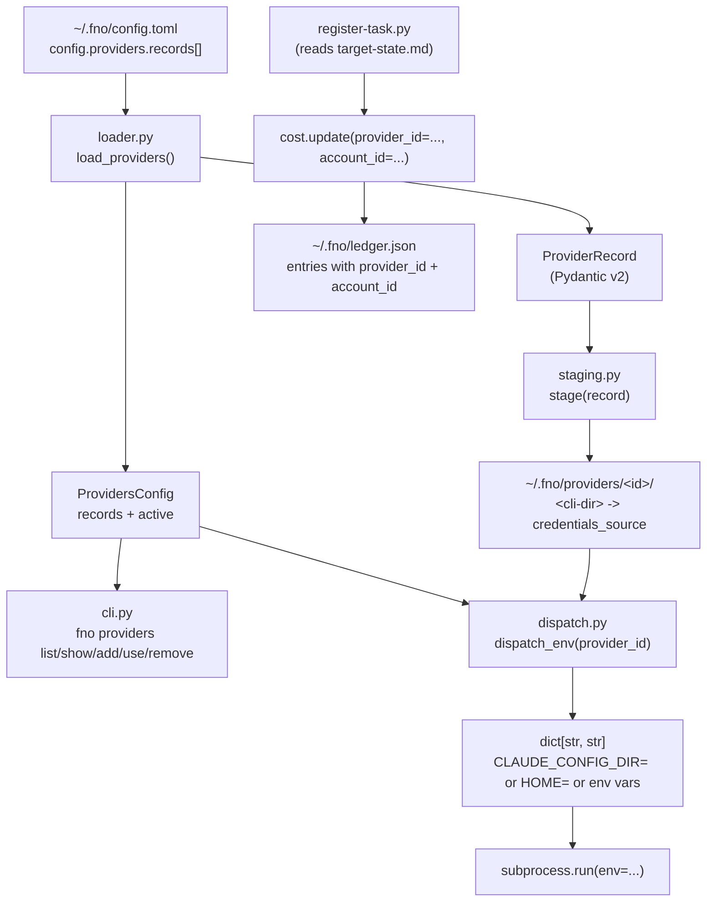

# Provider Rotation Substrate

## Overview

The provider rotation substrate (Spec 1 of 4) gives footnote a typed model for "which CLI + which credentials" a subprocess dispatch should use, and a pure helper that returns the env dict for that combination. It ships data + dispatch primitives only. Specs 2 through 4 layer reactive failover, per-agent routing, and proactive round-robin on top of this substrate.

The motivating use case is daily-driver reliability across Jason's accounts: 2x Claude Max OAuth, 2x Gemini Pro OAuth, plus Anthropic API credits via OpenClaw, Hermes, and Codex. Manual switching between accounts replaces the cc-switch step run between sessions today.

## Architecture

The substrate has four layers, each shipped in its own atomic commit:

1. Config schema (`model.py`, `loader.py`) - typed records read from config.toml with project-local-over-global precedence.
2. CLI surface (`cli.py`, `cli/src/fno/cli.py` registration) - `fno providers` Typer sub-app for human-driven management.
3. Credential staging + dispatch (`staging.py`, `dispatch.py`) - per-account directory with symlink to canonical OAuth dir, plus a pure dispatch_env helper.
4. Ledger attribution (`cost.py`, `register-task.py`, `session-cost.py`) - cost entries gain `provider_id` and `account_id` fields tagged at write time.

## Locked Decisions

These are non-negotiable for Specs 2 through 4. They are recorded here so future specs do not relitigate them.

| # | Decision | Why |
|---|----------|-----|
| 1 | Substrate-first sequencing; consumers ship as separate specs | Lets the substrate stabilize and be dogfooded manually before automation depends on it |
| 2 | Hybrid auth strategy: each record declares `auth: oauth_dir` or `auth: api_key` | OAuth-on-disk and env-var-keys have different staging needs; one-size validation cannot cover both |
| 3 | footnote owns provider config; no runtime dependency on cc-switch | cc-switch operates between sessions; footnote is the session, so provider state must live inside the substrate |
| 4 | Dispatch-level switching only; orchestrator-level failover delegated to existing `run-target-loop.sh` | Keeps the substrate purely about "what env do I pass to this subprocess"; failover policy is a Spec 2 concern |
| 5 | Layered routing precedence (agent > phase > default) - schema slot reserved here, consumers in Specs 3-4 | The YAML key shape is fixed now so Spec 3 does not have to migrate user configs |
| 6 | Conservative failure detection (Specs 2-4 territory; substrate just declares the data shape) | Substrate cannot know what counts as failure; only the consumer that dispatched the work does |
| 7 | Mode-aware end-of-queue (Spec 2 territory) | Same reasoning as #6 |
| 8 | OAuth symlink, not copy or fswatch | Anthropic's OAuth refresh writes back to the canonical dir; the symlink resolves through, so isolation comes from per-id separation, not from filesystem-level copies |
| 9 | HOME override for gemini/codex/openclaw/hermes | These CLIs lack a clean `*_CONFIG_DIR` env var; setting `HOME=<root>/<id>/home/` is uniform across them |
| 10 | `${KEYCHAIN:...}` resolution via the macOS `security` CLI | No third-party keychain libraries; Linux/Windows support deferred |

## Module Boundaries

The substrate package is `cli/src/fno/adapters/providers/`. No code outside this directory imports from it (yet); the public surface is the re-export list in `__init__.py`.

| Module | Responsibility | Imports from |
|--------|---------------|--------------|
| `model.py` | ProviderRecord, ProvidersConfig, four exception classes | pydantic, pathlib |
| `loader.py` | load_providers, save_providers | model, fno.state.io |
| `cli.py` | `fno providers` Typer sub-app | model, loader, staging, dispatch |
| `staging.py` | stage, unstage, verify_staged | model, pathlib, shutil |
| `dispatch.py` | dispatch_env, resolve_env_value | model, loader, staging, subprocess |

`cli/src/fno/cli.py` registers the sub-app via a single `app.add_typer(providers_app, name="providers")` line, mirroring the existing `app.add_typer(graph_app, name="backlog")` pattern.

`cli/src/fno/cost.py` gains two optional keyword-only parameters (`provider_id`, `account_id`); the entry only includes the keys when non-None. `scripts/metrics/register-task.py` reads them from `target-state.md` frontmatter and propagates. `scripts/metrics/session-cost.py` aggregates by `entry.get("provider_id", "unattributed")` so old-format ledger entries land in the unattributed bucket.

## Concurrency Guarantees

`dispatch_env` is a pure function: no caching, no global state, no I/O beyond reading config.toml. AC03.3 verifies this with a `concurrent.futures.ThreadPoolExecutor` running 100 calls per provider across 8 workers, asserting that no result for provider A ever leaks values from provider B.

`cost.update` uses the existing `filelock` pattern; AC04.6 covers the concurrent-write case. The substrate inherits the atomic-write guarantee already validated in the broader CLI test suite.

## What This Substrate Does NOT Do

This is the explicit list of capabilities deferred to later specs. Reading this section before reaching for the substrate prevents accidental scope expansion.

- Reactive failover (Spec 2) - if a dispatch fails with rate-limit/quota, the substrate has no opinion about retrying with another provider.
- Per-agent routing (Spec 3) - sigma-review subagents cannot yet ask the substrate "give me a non-Claude provider for this review".
- Per-phase pinning (Spec 4) - the YAML key shape is reserved but the lookup logic is not implemented.
- Proactive round-robin (Spec 4) - no rotation cursor, no usage tracking.
- Linux/Windows keychain support - `${KEYCHAIN:...}` only resolves on macOS via the `security` CLI.
- Provider availability detection - a provider that has been quota-exhausted looks identical to a healthy one until dispatch.

## Failure Modes Inventory

The plan's design doc enumerates failure modes per category. The substrate addresses these:

| Failure mode | Where addressed | Phase |
|--------------|-----------------|-------|
| Empty provider list at config load | Returns ProvidersConfig(records=[], active=None) without error; rejected only at dispatch time | 01 |
| Auth declaration mismatched with credentials | model_validator raises with literal phrase `auth_strategy_mismatch` | 01 |
| Active record id not in records list | loader raises ProviderConfigError with `active_record_not_found` | 01 |
| Duplicate record ids in YAML | ProvidersConfig model_validator rejects with `duplicate_record_ids` | 01 (added during sigma-review) |
| Missing credentials_source path | stage() raises ProviderStagingError with the path | 03 |
| Existing symlink with wrong target | stage() raises (idempotent only on matching target) | 03 |
| Unstaged provider at dispatch | dispatch_env raises ProviderUnavailableError, distinct from ProviderNotFoundError | 03 |
| Unresolvable env reference | resolve_env_value raises ProviderUnavailableError naming the reference | 03 |
| Concurrent dispatch contamination | dispatch_env is pure, ThreadPoolExecutor-tested | 03 |
| Concurrent ledger write | cost.update uses filelock, atomic temp-file write | 04 |
| Save against corrupt config.toml | save_providers reads strict, raises ProviderConfigError instead of silently overwriting unrelated keys | 01 (added during sigma-review) |
| Tilde in credentials_source not expanded | field_validator on ProviderRecord.credentials_source calls .expanduser() | 01 (added during sigma-review) |

## Tests

Coverage is split between in-package pytest (logic correctness) and out-of-package bash tests (CLI surface integration).

| Test | Scope | Lines covered |
|------|-------|---------------|
| `cli/src/fno/adapters/providers/test_model.py` | Pydantic field validation, conditional auth, regex constraints | model.py |
| `cli/src/fno/adapters/providers/test_loader.py` | config.toml parse, project-local override, save round-trip, corrupt-file refusal | loader.py |
| `cli/src/fno/adapters/providers/test_cli.py` | Typer CliRunner: list/show/add/test/use/remove + 5 ACs | cli.py |
| `cli/src/fno/adapters/providers/test_staging.py` | symlink ops, idempotency, error paths | staging.py |
| `cli/src/fno/adapters/providers/test_dispatch.py` | env resolution, concurrency (ThreadPoolExecutor), keychain mocking | dispatch.py |
| `cli/src/fno/test_cost.py` | tagged write, untagged write, mixed-schema ledger, concurrent atomic write | cost.py |
| `tests/test_register_task_provider_attribution.sh` | register-task.py reads target-state.md, propagates fields | register-task.py |
| `tests/test_provider_substrate_e2e.sh` | full add → list → stage → use → dispatch → cost-write → remove cycle | end-to-end |

98 pytest tests + 18 bash assertions across the substrate. All hermetic via `tmp_path` / `mktemp -d` + HOME override.

## Migration Path for Spec 2

When reactive failover lands, the integration point is `dispatch_env` plus a new function `next_provider(after_failed: ProviderRecord, queue: list[ProviderRecord]) -> ProviderRecord | None` that the orchestrator (e.g., `loop.py`) calls between phase dispatches. The substrate's `priority: int` field on each record is the failover-queue ordering hint reserved for that purpose.

The substrate already commits the data shape Spec 2 will need:
- `priority` for ordering
- `tags: list[str]` for cost-class filtering (Spec 4)
- Distinct `ProviderUnavailableError` for "skip and try next" vs `ProviderNotFoundError` for "stop, programming error"

Spec 2 should NOT extend ProviderRecord with new fields; if more state is needed, attach it to a separate "rotation cursor" file under `~/.fno/providers-state.json` so the substrate stays reusable.

## See Also

- User-facing reference: `docs/provider-rotation.md`
- CLAUDE.md "Provider Rotation Substrate" section for the contributor-facing surface summary
