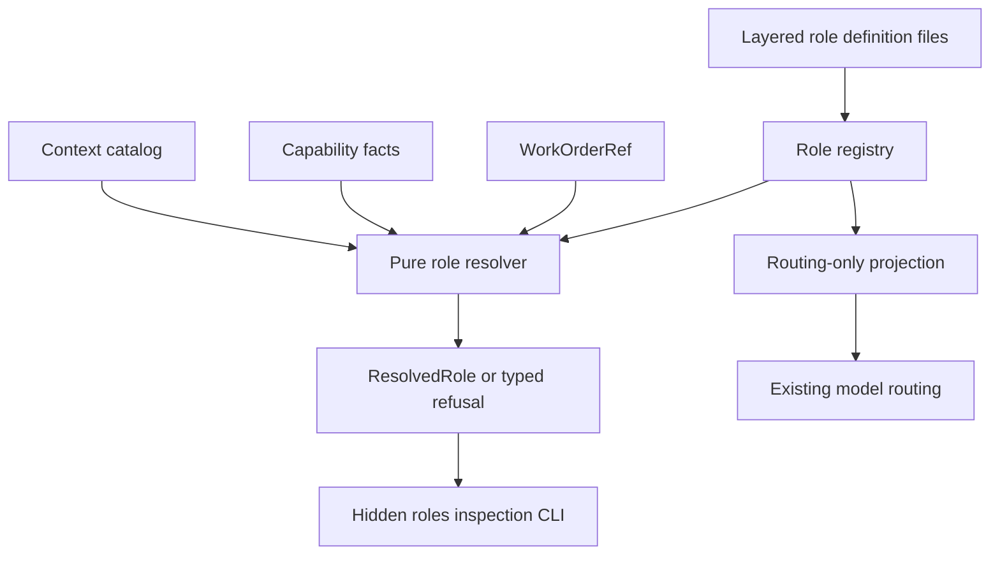

# Roles and Bounded Context

## Overview

Business-role resolution binds an immutable responsibility manifest and a bounded set of context references to one existing company work-order attempt.
It is an additive contract layer: the Footnote graph remains the sole work authority, capability facts remain independent inputs, and a resolved role cannot create work, grant access, approve an effect, or evaluate delivery.

## Component Graph



## Resolution Flow


Definitions are considered in the fixed order `built-in`, `plugin`, `company`, `project`, and `plan`.
The registry retains contributing and shadowed definitions, rejects ambiguous definitions in one layer, and blocks on corrupt or unreadable sources instead of treating them as absent.
Resolution is deterministic over explicit definitions, capability facts, context references, a work order, a clock, a snapshot revision, and bundle bounds.

## Contract Surface

| Contract | Purpose |
|---|---|
| `RoleManifest` | Declares identity, mission, deliverables, required capabilities, authority ceiling, approval floor, context selectors, review and delivery requirements, topology, and an optional routing hint. |
| `RoleDefinitionSource` | Attributes a manifest or validation failure to one discovery layer, source, and snapshot revision. |
| `CapabilityFact` | Reports independently supplied capability availability for an optional work-order scope; it does not grant the capability. |
| `ContextReference` | Describes provenance, scope, digest, revision, freshness, sensitivity, size, and readability without copying source content. |
| `ContextBundle` | Captures the smallest selected reference set within explicit count, byte, sensitivity, and candidate-combination bounds. |
| `ResolvedRole` | Captures the complete source chain, effective manifest, bounded bundle, requirements, policies, routing projection, and stable digests. |
| `RoleResolutionBlocked` | Returns one typed refusal with the responsible layer, source, reference, and detail. |
| `ManifestRoutingResolution` | Carries only validated role identity, source digest, and provider/model projection into model routing. |

All contracts are frozen and reject unknown fields.
Role manifests reuse `FunctionRef`, `RoleRef`, and `WorkOrderRef` from the company-work contracts rather than creating parallel identity types.

## Tightening-Only Overlays

A higher layer may narrow deliverable kinds, delegation targets, required capabilities, context selectors, and sensitivity; require freshness metadata; lower the authority ceiling; raise the approval floor; strengthen review requirements; make delivery requirements stricter; or choose a more specific routing hint.
It may not change role identity, widen authority or context, add delegation, deliverable, or capability scope, drop a freshness requirement, lower the approval floor, weaken review, or relax delivery requirements.
The approval floor is ordered `none`, `principal`, then `founder`, so a founder-approved public-publication role cannot be overlaid into autonomous execution.
The complete candidate overlay is validated before publication, so a violation returns a typed refusal and never exposes a partially broadened role.

## Capability and Context Boundaries

For a principal-bound work order, a required capability is satisfied only by a fact scoped to the same node, attempt, principal, and role.
Unscoped capability facts are accepted only for work orders without a principal.
Context references follow the same work-order boundary and must also match the requested snapshot, be readable, satisfy any declared freshness requirement, fit the selector sensitivity, and remain within bundle limits.
Naming a context reference does not grant access to its content; consumers must still enforce access at the read boundary.

## Routing Compatibility

`resolve_route` and `resolve_codex_route` perform conventional business-role discovery at their shared production seam.
When no role-definition root exists, or a requested role is genuinely absent from a valid root, they preserve the existing routing-only provider, model, environment, notice, and fallback behavior.
When a manifest resolves, only its optional provider/model projection enters routing.
If that optional projection is absent, the worker stays on its primary model; a partial projection that cannot compose still refuses.
Invalid, unreadable, mixed-revision, or authority-expanding manifests fail closed before a worker route is selected.
Protected roles still validate discovery but remain on their primary model, and explicit peer routes retain their existing independent behavior.

## Inspection

The hidden `fno roles ls`, `fno roles show`, and `fno roles resolve` commands inspect JSON definitions and emit stable text or JSON.
By default, discovery reads layer directories beneath `FNO_ROLES_ROOT`, or the repository-root `.fno/roles` when the environment variable is unset.
An unset conventional root means the feature is absent, while an explicitly configured missing root is an attributed configuration refusal.
Inspection may also receive an explicit root or repeatable `--source layer=path` inputs.
The commands do not spawn agents, acquire claims, mutate the graph, change definitions, or expand the curated command menu.

## Out of Scope

An approval floor is a declarative minimum only; role resolution does not implement a coordinator, approval workflow, approval receipt, effect state, evidence verdict, or delivery evaluation.
`DeliveryPolicy` declares future evidence requirements only; sibling systems remain responsible for evaluating them and recording outcomes.

## Verification

Run the bounded-role, inspection, and routing compatibility suites through the repository wrapper:

```bash
fno doctor test cli/tests/unit/roles/test_resolver.py cli/tests/unit/roles/test_roles_cli.py cli/tests/unit/agents/test_model_routing_roles.py cli/tests/unit/test_model_routing.py
```

Run `fno doctor lint menu-caps` to prove the hidden integration does not expand the curated CLI surface.
