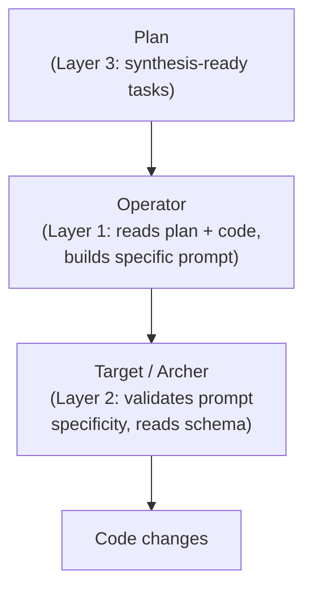

# Synthesis Guardrails

## Overview

Lazy delegation is the failure mode where an orchestrator passes a vague prompt like "based on your findings, fix the bug" to a subagent. The subagent has zero context and must rediscover everything the orchestrator already read. The fix requires the orchestrator to prove it read the code by including file paths, line numbers, and specific changes in every dispatch prompt.

Three layers enforce this at different points in the pipeline.

## Data Flow

## Three Layers

### Layer 1 - Operator Synthesis Protocol

**Location:** `skills/do/references/waves.md` Section 3a, `skills/do/references/synthesis-checklist.md`

Before every `Task` tool invocation the operator runs a five-point checklist:

| Check | Requirement |
|-------|-------------|
| File path | Exact path(s) affected, not directory |
| Structural location | Function, class, or line range |
| Current state | What the code does now |
| Target state | What it must do after the change |
| Reasoning | Why this change fixes the problem |

The prompt must contain all five items. A prompt missing any item is rejected before dispatch.

| Bad | Good |
|-----|------|
| "Fix the ratio bug" | "Edit `src/ratio.ts:42` - `calculate()` divides before filtering; change denominator to `activeStaff.length`" |
| "Based on your findings, update the schema" | "Add `active BOOLEAN NOT NULL DEFAULT true` to `staff` in `db/migrations/004.sql`" |
| "Handle the error case" | "In `api/handlers/staff.ts:67` return 422 when `body.facility_id` is missing, matching pattern at line 45" |

### Layer 2 - Agent Self-Check

**Location:** `agents/target.md`, `agents/archer.md`

Two checks run before any code is written:

**Step 1b - Prompt Specificity Check.** The agent inspects the incoming prompt for vague delegation phrases ("based on your findings", "fix the issue", "update as needed"). A prompt that fails this check returns `BLOCKED` immediately with a message requesting a specific prompt from the operator.

**Step 1c - Schema and Type Verification.** Before writing code that touches types, DB columns, or API contracts, the agent reads canonical definitions from `config.schema_sources` (settings.yaml keys: `types`, `db`, `api`, `naming_boundary`). The setup wizard (`skills/setup/SKILL.md`) includes a Schema Sources step so brownfield projects populate these paths during onboarding.

### Layer 3 - Plan Template

**Location:** `skills/plan/SKILL.md`

A fourth writing principle (synthesis-readiness) is added to the task template. Each task must include the exact file(s) to change, current behavior, target behavior, and any schema or type boundaries. This ensures tasks arriving at the operator are already structured for specific dispatch, reducing the synthesis burden at Layer 1.

## Files Changed

| File | Layer | Change |
|------|-------|--------|
| `skills/do/references/waves.md` | 1 | Section 3a: pre-dispatch checklist |
| `skills/do/references/synthesis-checklist.md` | 1 | Five-point checklist (new file) |
| `agents/target.md` + `agents/archer.md` | 2 | Step 1b (vague prompt detection) + Step 1c (schema read) |
| `skills/setup/SKILL.md` | 2 | Schema Sources onboarding step |
| `skills/plan/SKILL.md` | 3 | 4th writing principle: synthesis-readiness |
