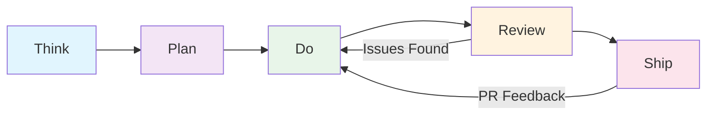
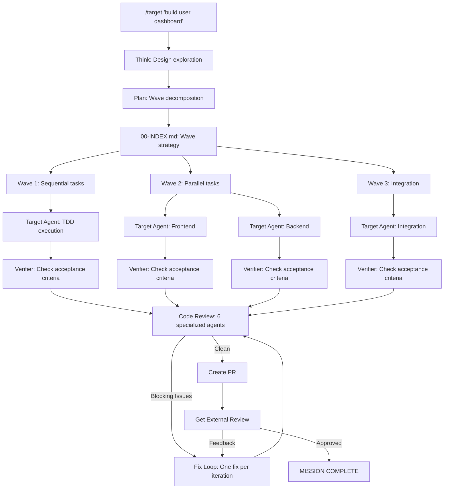

# footnote Plugin - Project Overview & Product Design Review

## Problem Statement

AI coding assistants today are copilots. They suggest code, answer questions, and generate snippets - but they do not ship features. The gap between "here is some code" and "here is a working, tested, reviewed PR" remains a manual process that requires a developer to:

1. Decompose the feature into tasks
2. Write tests before or alongside implementation
3. Execute tasks in the right order (respecting dependencies)
4. Run quality checks and code review
5. Create a pull request with proper description
6. Address review feedback
7. Actually merge and ship

For solo founders and small teams, this gap is the bottleneck. They do not need another autocomplete tool - they need an autonomous software engineer that takes a feature from idea to shipped PR while they focus on product decisions.

### The Core Problem

> AI copilots suggest. They do not ship.

Every existing AI coding tool stops at generation. The developer is still responsible for orchestrating the workflow, running verification, catching regressions, and closing the loop. The "last mile" of software delivery - quality gates, review, PR creation, feedback incorporation - remains entirely manual.

## Solution Overview

**footnote** is a Claude Code plugin that turns Claude from a copilot into an autonomous software engineer. It provides a complete development workflow: think, plan, do, review, ship.

The plugin is a metalayer above individual AI skills. It does not just generate code - it orchestrates the entire delivery pipeline with quality gates at every stage, mechanical verification instead of trust, and a stop hook that literally prevents the AI from quitting until the work is done.

### The Workflow



**Detailed pipeline flow:**



## Core Concepts

### 1. The Target Loop

Target is the autonomous delivery pipeline. Named as a persona, target is the agent that refuses to stop until the feature is actually shipped. The key mechanism:

- A **stop hook** (`target-stop-hook.sh`) is a thin shim over the read-only `fno-agents loop-check` verb, which decides whether the session may exit.
- The agent signals it believes the work is done by emitting a `<promise>` tag; `loop-check` then verifies that claim against external truth before allowing exit.
- If the session ends before completion, the unified loop (`fno-agents loop run` / `run-target-loop.sh`) re-invokes it.

**Completion is external truth, not local booleans.** A session is done only when the world agrees:
- a PR exists,
- CI is green on it,
- every required reviewer bot (`config.review.required_bots`) has reviewed with no unaddressed blocking finding,
- and a budget cap has not been exceeded.

There are no completion-gate booleans, no `fno gate` surface, and no `current_phase` state - the pre-wedge gate machinery was removed in the control-plane collapse. `loop-check` writes nothing; terminal side-effects (ledger record, plan stamp, handoff) are written by the separate `fno-agents finalize` verb.

**Allowed statuses:** `IN_PROGRESS`, `COMPLETE`, `BLOCKED` - nothing else. Any other status breaks the loop.

### 2. Wave-Based Orchestration

Plans decompose features into waves with explicit execution modes:

```yaml
execution_mode: mixed
waves:
  - wave: 1
    mode: sequential
    tasks: [1.1]          # Foundation - must complete first
  - wave: 2
    mode: parallel
    tasks: [2.1, 2.2, 2.3]  # Independent tasks - run simultaneously
  - wave: 3
    mode: sequential
    tasks: [3.1]          # Integration - depends on wave 2
```

The **operator** skill routes tasks to specialized target agents based on keywords in the task description:

| Keywords | Agent Specialization |
|----------|---------------------|
| frontend, react, ui, component, tailwind | Frontend target |
| backend, api, supabase, auth, database | Backend target |
| devops, docker, ci/cd, deploy, terraform | DevOps target |
| etl, pipeline, data, analytics | Data target |

### 3. Quality Gates

Quality is not optional and not negotiated. The plugin enforces multiple layers:

- **TDD discipline** - target agents write the failing test first, verify it fails, then implement. Every task.
- **Code review** - 6 specialized subagents run in parallel, each checking a different concern:
  - `code-reviewer` (Opus) - CLAUDE.md compliance, bugs, code quality
  - `type-design-analyzer` (Sonnet) - type invariants, encapsulation
  - `integration-test-analyzer` - journey tests, DB verification
  - `silent-failure-hunter` - error swallowing, missing handlers
  - `ux-flow-tester` - user journey simulation
  - `multi-device-checker` - responsive/cross-device behavior
- **Verification agents** - independent verifier checks acceptance criteria after task completion
- **Goal verifier** - validates original user goals are met, not just task checklists

## Target Users

### Primary: Solo Founders

Solo founders building products cannot afford to context-switch between product decisions and implementation details. footnote lets them describe what they want built, review the plan, and let the autonomous pipeline handle execution through shipping.

### Secondary: Small Teams (2-5 developers)

Small teams where every developer is stretched across multiple concerns. The plugin handles the mechanical work - test writing, code review, PR creation - while humans focus on architecture decisions and product direction.

### Anti-Targets

- Large enterprise teams with established CI/CD and dedicated QA - they have humans for this
- Developers who want fine-grained control over every line - target makes autonomous decisions
- Teams that do not use git-based workflows - the plugin assumes git + PR-based delivery

## Key Differentiators

### vs. GitHub Copilot / Cursor / Other AI Editors

These tools are code generators. They suggest completions and generate files. The developer still orchestrates the workflow. footnote orchestrates the entire pipeline - from decomposing the feature into waves, through TDD execution, code review with 6 specialized agents, to PR creation and review feedback incorporation.

### vs. Devin / Other AI Agents

Other AI agents run in sandboxed environments and produce code that needs manual integration. footnote runs directly in the developer's environment, commits to real git branches, creates real PRs, and uses real test runners. The stop hook mechanism means the agent literally cannot quit until the work ships.

### vs. Custom Prompting / Workflows

Many developers build their own multi-step prompts. footnote captures these patterns in reusable, tested skills with proper state management, failure handling, and cross-session persistence.

### The Real Differentiator: It Does Not Stop

Most AI tools complete when they generate output. Target completes when the PR is merged. The stop hook is not a suggestion - it is a shell script that blocks the exit signal. The external loop script re-invokes the CLI if the session dies. This is the fundamental difference: footnote is built around the premise that shipping is the only acceptable outcome.

## Current Goals

### G1: Reliable Autonomous Delivery

The target loop should complete features end-to-end with minimal human intervention. Current target: 80%+ of planned tasks complete successfully without manual intervention.

### G2: Multi-CLI Portability

Skills are portable across Claude Code, Gemini CLI, and Codex CLI. Hooks are platform-specific but follow the same state machine. The goal is write-once skills that work everywhere.

### G3: Cost Efficiency

Token usage optimization through tiered model selection (Haiku for mechanical tasks like PR creation, Sonnet for implementation, Opus for complex review), context forking for isolated tasks, and focused plans that avoid over-decomposition.

### G4: Domain-Agnostic Operation

Currently optimized for web application development. The vision is domain profiles that adapt the pipeline for infrastructure, data engineering, mobile, and non-code domains (documentation, research, analysis).

## Design Philosophy

### Evidence Before Claims

The plugin never trusts the AI's claim that something works. Every claim is mechanically verified:

- "Tests pass" - actually run the test suite and check the exit code
- "Build succeeds" - actually run the build command
- "Feature works" - spawn the verifier agent to independently check acceptance criteria
- "PR is ready" - run all 6 review agents before creating it

### Test-First, Always

Target agents follow strict TDD: write the failing test, verify it fails (red), implement minimal code (green), verify the test passes. This is not a suggestion - the `validate-test-first.sh` script checks commit history for compliance.

### Mechanical Verification Over Human Trust

Automated checks replace human inspection wherever possible. The code review agents check for silent failures, type design issues, integration gaps, UX flow bugs, and multi-device problems - all mechanically, all in parallel.

### Atomic Operations

One task = one commit. One fix = one iteration. If a fix introduces a regression, it gets reverted. Small, verifiable changes that can be individually validated and rolled back.

### Bounded Iteration

All loops have explicit bounds. The target loop has max iterations. The fix loop does one fix per iteration and auto-reverts on regression. The debug loop follows the scientific method with hypothesis tracking. Nothing runs unbounded.

## Architecture Summary

```
footnote/
  .claude-plugin/            # Plugin manifest (plugin.json, marketplace.json)
           # Core plugin
    skills/                  # 26 skills - the portable workflow steps
    agents/                  # 12 subagents - specialized executors
    hooks/                   # Stop hooks + session-start injection
    commands/                # Slash commands (UI layer)
    scripts/                 # Shell scripts for metrics, validation, setup
    runtime/                 # Provider capabilities, adapter configs
```

Skills are the portable unit. Each skill is a directory with a `SKILL.md` (YAML frontmatter + markdown instructions), optional `references/` for supporting docs, and optional `scripts/` for shell automation. Agents are single `.md` files with frontmatter defining model, tools, and skills they can use.

The plugin requires no build step. It is interpreted scripts (bash/zsh), Python (orchestrator), and markdown (skills/agents). Install by pointing Claude Code at the plugin directory or symlinking to `~/.claude/plugins/`.
