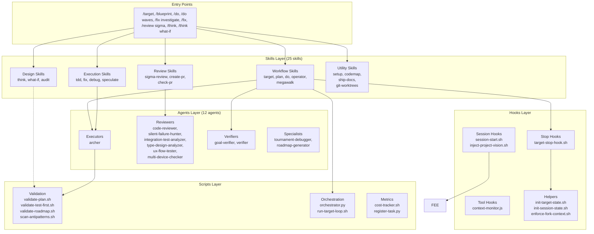
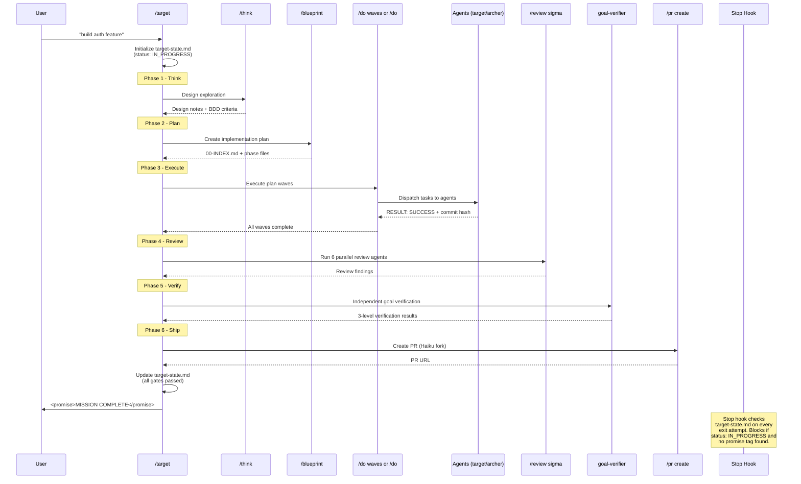
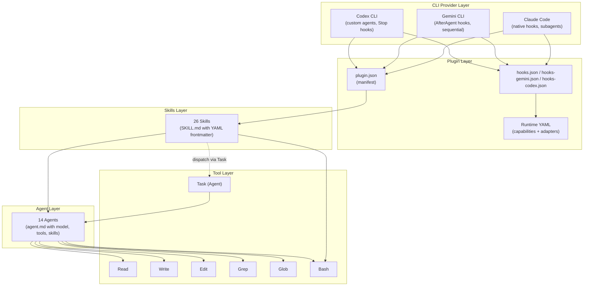
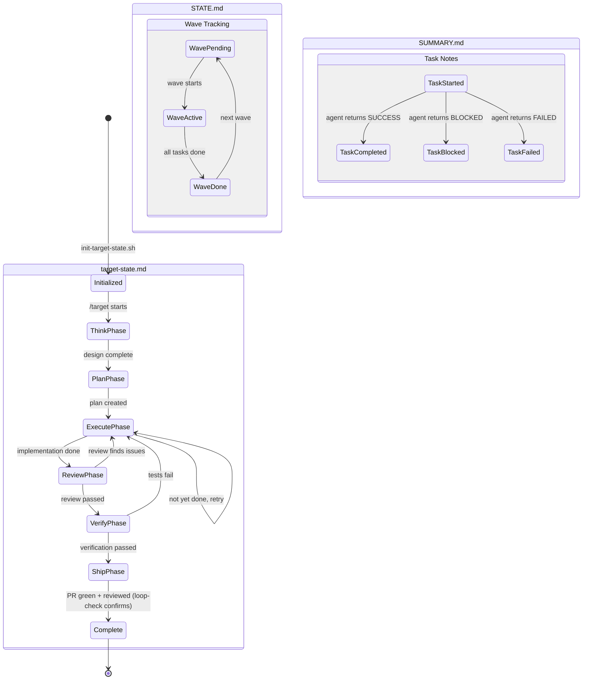
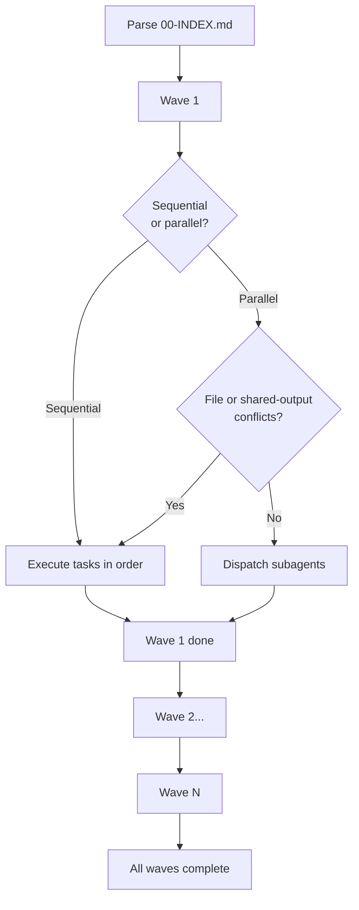

# System Architecture

This document describes the internal architecture of the **footnote** Claude Code plugin - an autonomous development workflow that takes features from idea to shipped PR.

---

## Table of Contents

1. [High-Level Overview](#high-level-overview)
2. [Component Relationship Diagram](#component-relationship-diagram)
3. [Data Flow - Feature Lifecycle](#data-flow---feature-lifecycle)
4. [Service Dependency Graph](#service-dependency-graph)
5. [Execution Model](#execution-model)
6. [State Management](#state-management)
7. [Plugin Loading Mechanism](#plugin-loading-mechanism)
8. [Skill Resolution Chain](#skill-resolution-chain)
9. [Hook Event System](#hook-event-system)
10. [Multi-CLI Adapter Pattern](#multi-cli-adapter-pattern)
11. [Wave Orchestration Engine](#wave-orchestration-engine)
12. [Cross-Project Worktree Architecture](#cross-project-worktree-architecture)
13. [Context Forking](#context-forking)

---

## High-Level Overview

footnote is structured as a layered plugin with six architectural layers:

| Layer | Count | Purpose |
|-------|-------|---------|
| Skills | 26 | Markdown files with YAML frontmatter defining capabilities |
| Agents | 12 | Subagent definitions spawned by skills for isolated work |
| Hooks | 8 scripts + 3 configs | Event interceptors for lifecycle control |
| Commands | 6 | Slash command entry points mapping to skills |
| Scripts | 40+ | Shell/Python utilities for validation, orchestration, metrics |
| Runtime | 2 YAML | Provider capabilities and target adapters per CLI |

---

## Component Relationship Diagram



---

## Data Flow - Feature Lifecycle

How a feature flows from idea through the target pipeline to shipped PR:



---

## Service Dependency Graph



---

## Execution Model

Three execution paths with increasing autonomy:

```mermaid
graph LR
    subgraph "Lightweight - /do"
        DO_IN["Plan path<br/>(flat plan)"] --> DO_READ["Read plan"]
        DO_READ --> DO_EXEC["Execute sequentially<br/>in main session"]
        DO_EXEC --> DO_COMMIT["Atomic commit"]
        DO_COMMIT --> DO_DONE["Done"]
    end

    subgraph "Heavy - /do waves"
        OP_IN["Plan path<br/>(00-INDEX.md)"] --> OP_PARSE["Parse waves<br/>(orchestrator.py)"]
        OP_PARSE --> OP_W1["Wave 1<br/>(sequential)"]
        OP_W1 --> OP_W2["Wave 2<br/>(parallel subagents)"]
        OP_W2 --> OP_WN["Wave N..."]
        OP_WN --> OP_STATE["Update STATE.md"]
        OP_STATE --> OP_DONE["All waves done"]
    end

    subgraph "Autonomous - /target"
        RA_IN["Feature string<br/>or plan path"] --> RA_INIT["Init target-state.md"]
        RA_INIT --> RA_THINK["Think"]
        RA_THINK --> RA_PLAN["Plan"]
        RA_PLAN --> RA_DO["Execute<br/>(/do waves or /do)"]
        RA_DO --> RA_REVIEW["Code Review<br/>(6 agents)"]
        RA_REVIEW --> RA_VERIFY["Goal Verify<br/>(3-level)"]
        RA_VERIFY --> RA_SHIP["Ship PR"]
        RA_SHIP --> RA_GATES{"All gates<br/>passed?"}
        RA_GATES -->|No| RA_DO
        RA_GATES -->|Yes| RA_PROMISE["promise tag"]
    end

    style DO_DONE fill:#90EE90
    style OP_DONE fill:#90EE90
    style RA_PROMISE fill:#90EE90
```



### Execution Path Comparison

| Aspect | /do (Lightweight) | /do waves (Heavy) | /target (Autonomous) |
|--------|-------------------|--------------------|---------------------|
| Input | Flat plan file | 00-INDEX.md with waves | Feature string or plan path |
| Session | Single | Single | Multi-iteration, stop-hook enforced |
| Parallelism | None | Wave-based via subagents | Inherits from /do waves |
| State tracking | None | STATE.md | target-state.md + STATE.md |
| Completion | Manual | Manual | External truth: PR green + reviewed (loop-check) |
| Exit control | Normal | Normal | Stop hook blocks until loop-check confirms done |

---

## State Management



### State File Details

**target-state.md** (session manifest):

Inputs-only and immutable after `fno target init` (control-plane collapse). No `status`, no `current_phase`, no gate booleans, no `iteration`.
```yaml
---
session_id: "..."
created_at: 2026-06-07T12:00:00Z
input: "feature description or plan path"
plan_path: null            # first-fill only after init
provider: claude
provider_mode: standard
claude_transcript_id: "..."
graph_node_id: ab-xxxxxxxx
# plus skip flags, budget caps, ownership fields - see control-plane-loop.md
---
```

**STATE.md** (wave-level):
```markdown
## Wave Progress

| Wave | Mode | Tasks | Status |
|------|------|-------|--------|
| 1 | sequential | 1.1 | DONE |
| 2 | parallel | 2.1, 2.2, 2.3 | IN_PROGRESS |
| 3 | sequential | 3.1 | PENDING |
```

**SUMMARY.md** (task-level):
```markdown
## Task 2.1: Implement auth middleware
- Status: SUCCESS
- Commit: abc1234
- Notes: Added JWT validation, rate limiting
- Concerns: Token refresh not covered in plan
```

---

## Plugin Loading Mechanism

The plugin is loaded via the `.claude-plugin/plugin.json` manifest:

```json
{
  "name": "footnote",
  "version": "1.0.0",
  "description": "Autonomous development workflow: think -> plan -> do -> review -> ship.",
  "author": {"name": "Jason Noah Choi"},
  "keywords": ["workflow", "tdd", "planning", "code-review", "autonomous", "target"]
}
```

**Installation methods:**

1. **Development** (temporary): `claude --plugin-dir /path/to/footnote`
2. **Permanent** (symlink): `ln -s /path/to/footnote ~/.claude/plugins/footnote`

The CLI discovers skills from `skills/*/SKILL.md`, agents from `agents/*.md`, and commands from `commands/*.md`. Hook configurations are loaded from `hooks/hooks.json` (Claude Code), `hooks-gemini.json` (Gemini CLI), or `hooks-codex.json` (Codex CLI).

---

## Skill Resolution Chain

```
User input -> Slash command -> Command definition -> Skill SKILL.md -> Agent dispatch -> Tool calls
```

1. **Command lookup**: `/target "build auth"` matches `commands/` entry or skill name
2. **Skill loading**: `skills/target/SKILL.md` is loaded with YAML frontmatter parsed
3. **Hook execution**: Skill-level hooks fire (e.g., `init-target-state.sh` via PreToolUse)
4. **Agent dispatch**: Skill spawns agents via the `Task` tool (e.g., archer for execution)
5. **Tool access**: Agents receive their declared tool set (Read, Write, Edit, Grep, Glob, Bash)
6. **Return contract**: Agents return structured results (RESULT, TASK, COMMIT, CONCERNS, ERROR)

### Skill Frontmatter Schema

```yaml
---
name: skill-name
description: "When to use this skill"
argument-hint: "<required> [--optional]"
context: fork          # Optional: run in isolated subprocess
model: haiku           # Optional: override model
hooks:                 # Optional: skill-specific hooks
  PreToolUse:
    - matcher: ".*"
      once: true
      hooks:
        - type: command
          command: "path/to/script.sh"
---
```

---

## Hook Event System

Hooks intercept CLI lifecycle events to enforce behavior. The footnote plugin uses three event types across three platform configs.

### Event Types

| Event | Claude Code | Gemini CLI | Codex CLI |
|-------|-------------|------------|-----------|
| Session start | `SessionStart` | `SessionStart` | `SessionStart` |
| Stop/exit | `Stop` | `AfterAgent` | `Stop` |
| Tool use | `PostToolUse` | `BeforeAction` | `PreToolUse` |

### Hook Scripts

| Script | Event | Purpose |
|--------|-------|---------|
| `target-stop-hook.sh` | Stop | Blocks exit when target-state.md is IN_PROGRESS and no promise tag |
| `session-start.sh` | SessionStart | Cross-platform wrapper that injects vision |
| `inject-project-vision.sh` | SessionStart | Loads project context into session |
| `context-monitor.js` | PostToolUse | Monitors context window usage (Claude Code only) |
| `init-target-state.sh` | PreToolUse | Initializes target-state.md before first tool action |

### Stop Hook Blocking Mechanism

The stop hook is the core enforcement mechanism for autonomous loops:

1. Hook reads JSON from stdin (transcript path, last assistant message)
2. Detects platform via environment variables (`CLAUDE_PLUGIN_ROOT`, `GEMINI_PROJECT_DIR`, `CODEX_PLUGIN_ROOT`)
3. Checks `target-state.md` for `status: IN_PROGRESS`
4. Scans last assistant output for `<promise>` tag
5. If in-progress and no promise: emits `block` decision with reason (becomes next user message)
6. If complete or promise found: emits `allow` decision

**Age-based state preservation (infinite loop fix):** `init-target-state.sh` will reset a `COMPLETE` or `BLOCKED` state file only when the `created_at` timestamp is older than 300 seconds. States created within the same session are preserved as-is. This prevents the stop hook from re-blocking a session that just finished: without the age check, the hook would see `IN_PROGRESS` (after an erroneous reset), feed a `--resume` message, and loop indefinitely.

Platform-specific output formats:
- **Claude Code**: `{"decision":"block","reason":"...","systemMessage":"..."}`
- **Gemini CLI**: `{"decision":"deny","reason":"..."}`
- **Codex CLI**: `{"decision":"block","reason":"...","systemMessage":"..."}`

---

## Multi-CLI Adapter Pattern

The plugin supports three CLI providers with a capability-based abstraction layer.

### Provider Capabilities Matrix

| Capability | Claude Code | Codex CLI | Gemini CLI |
|-----------|-------------|-----------|------------|
| Native hooks | Yes | Yes | Yes |
| Stop blocking | Yes | Yes | No (soft fallback) |
| Subagents | Yes (native) | Yes (custom) | No (sequential) |
| Parallel dispatch | Yes | Yes | No |
| Lifecycle mode | hook_enforced | hook_enhanced | hook_enhanced |
| Orchestration surface | native_subagents | custom_agents | sequential_main_thread |

### Target Adapters

The `target-adapters.yaml` maps each pipeline phase to provider-specific implementations:

| Phase | Core Runtime | Claude Adapter | Codex Adapter | Gemini Adapter |
|-------|-------------|----------------|---------------|----------------|
| think | fno:think | (default) | (default) | (default) |
| plan | fno:blueprint | (default) | (default) | (default) |
| execute | fno:operator | native_subagents | custom_agents | sequential_fallback |
| review | fno:sigma-review | code-reviewer | reviewer | in_session |
| verify | goal-verifier | goal-verifier | verifier | in_session |
| ship | fno:create-pr | (default) | (default) | (default) |

### Fallback Policies

When a provider lacks a capability, the system degrades gracefully:

- **Missing subagents**: Fall back to sequential main thread execution
- **Missing hooks**: Continue with manual lifecycle (hooks enhance but do not replace core semantics)
- **Hidden shared outputs**: Downgrade parallel wave to sequential (prevents concurrent writes to shared state files)

### Gemini Dynamic Upgrade

Gemini CLI can optionally upgrade from sequential fallback to experimental project-agent mode when:
1. `config.gemini_experimental_agents` is enabled
2. `.gemini/agents/` directory exists with required agent files (archer.md, reviewer.md, roadmap-generator.md, verifier.md)

---

## Wave Orchestration Engine

The orchestrator (`skills/do/orchestrator.py`) parses `00-INDEX.md` and dispatches tasks to agents.

### 00-INDEX.md Format

```yaml
execution_mode: mixed    # sequential | parallel | mixed
waves:
  - wave: 1
    mode: sequential
    tasks: [1.1]
  - wave: 2
    mode: parallel
    tasks: [2.1, 2.2, 2.3]
  - wave: 3
    mode: sequential
    tasks: [3.1]
```

### Agent Routing

Tasks are routed to specialized agent profiles based on keywords in the task description:

| Keywords | Domain | Agent Profile |
|----------|--------|---------------|
| frontend, react, ui, component, tailwind | Frontend | target (frontend) |
| backend, api, supabase, auth, database | Backend | target (backend) |
| devops, docker, ci/cd, deploy, terraform | DevOps | target (devops) |
| etl, pipeline, data, analytics | Data | target (data) |

### Hidden Shared Output Protection

The orchestrator detects when parallel tasks would write to shared paths and downgrades those waves to sequential execution:

```python
HIDDEN_SHARED_OUTPUT_ROOTS = (
    ".fno/",
    ".codex/agents/",
    ".gemini/agents/",
    "docs/",
    "internal/",
)
```

### Wave Execution Flow



---

## Multi-Repo Features (spawn-into-project)

There is no cross-project orchestration pipeline. A multi-repo feature is
decomposed into one backlog node per project (linked by `blocked_by`); each
node ships its own PR from its own repo. A `/target` session works only in its
own project; a foreign, unblocked wave is dispatched into its project via
`fno agents spawn --cwd <root> "/target <node>"`, and `fno backlog advance`
dispatches now-unblocked cross-project dependents when a node's PR merges.

---

## Context Forking

Some skills use `context: fork` in their frontmatter to run in an isolated subprocess with fresh context. This preserves main conversation context for complex work while offloading template-driven tasks.

| Skill | Model | Rationale |
|-------|-------|-----------|
| `/pr create` | Haiku | Mechanical task - read commits, generate PR description |

Forked skills:
- Run in a separate process
- Get their own context window
- Cannot access main conversation history
- Use a lighter/cheaper model when appropriate
- Return results to the main session when complete

The `enforce-fork-context.sh` helper ensures fork isolation is maintained.

---

## Directory Structure Reference

```
footnote/                               # Flat root (plugin.json at .claude-plugin/)
    .claude-plugin/
        plugin.json                      # Plugin manifest
        marketplace.json                 # Marketplace listing
    skills/                              # 26 skills
        target/SKILL.md                   # Autonomous pipeline
        plan/SKILL.md                    # Implementation planning
        do/SKILL.md                      # Lightweight executor
        operator/SKILL.md               # Heavy orchestrator
        sigma-review/SKILL.md            # Multi-agent review
        codemap/SKILL.md               # AST structural analysis
        megawalk/SKILL.md            # Multi-session orchestration
        ...
    agents/                              # 12 agents
        archer.md                       # TDD task executor (Sonnet)
        code-reviewer.md                # Code review (Opus)
        goal-verifier.md               # Goal verification (Sonnet)
        verifier.md                    # Task verification (Haiku)
        ...
    hooks/
        hooks.json                       # Claude Code hook config
        hooks-gemini.json               # Gemini CLI hook config
        hooks-codex.json                # Codex CLI hook config
        target-stop-hook.sh             # Stop hook (blocks exit)
        session-start.sh              # Cross-platform session init
        context-monitor.js            # Context monitoring
        helpers/                       # Hook helper scripts
    commands/                            # 6 slash commands
    scripts/                             # Shell/Python utilities
        lib/                            # Shared libraries
        metrics/                        # Cost tracking
```
