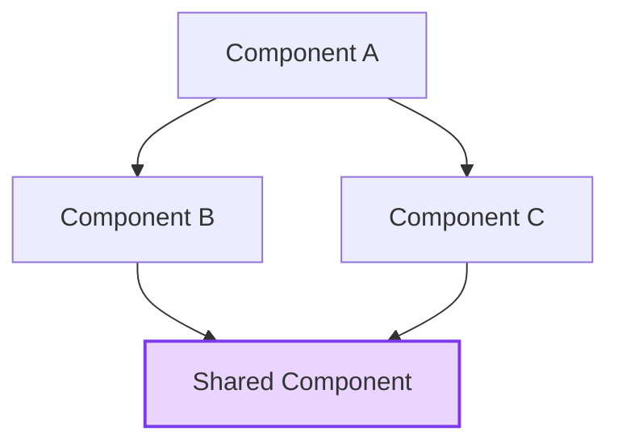
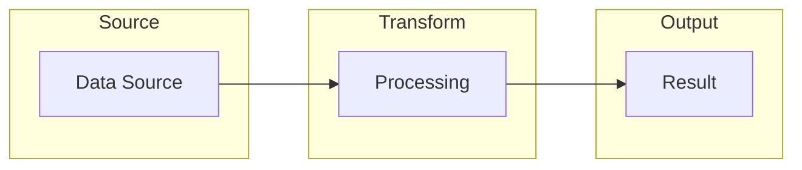

# Architecture Document Template

---
created: YYYY-MM-DDTHH:MM
status: accepted
---

# [Feature Name]

## Overview

[2-3 sentences: what this is, what it does]

## Component Graph

## Data Flow

## New Components

| Component | Location | Purpose |
|-----------|----------|---------|

## Modified Components

| Component | Change |
|-----------|--------|

## Dependencies

| Package | Version | Purpose |
|---------|---------|---------|

## Security

- [Security considerations]

## Design Tokens

| Token | Usage |
|-------|-------|

Save to: `internal/web/architecture/{feature}.md`

**Use Mermaid diagrams** for component graphs, data flows, and sequence diagrams. Obsidian renders them natively.
