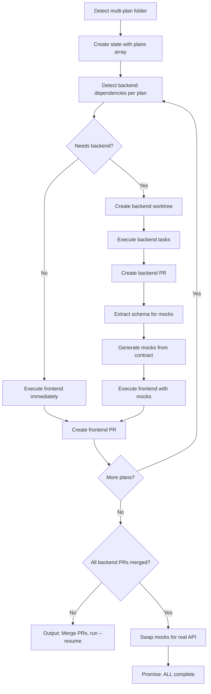

# Multi-Plan Mode Reference

Creates **separate worktrees and atomic PRs** for each numbered plan file in a folder.

## When to Use

- Multiple related plans that should be independent PRs
- Plans that can be reviewed/merged separately
- Avoiding giant "mega-PRs" with too many changes

## Requirements

1. **`fork` subcommand is required** - Multi-plan mode is explicit, not auto-detected
2. **Folder input required** - Cannot use `fork` with a file path
3. **Numbered prefixes** - Only files matching `[0-9][0-9]-*.md` are processed

## File Naming Convention

```
plans/
├── 00-INDEX.md           ← Master index (EXCLUDED - orchestration only)
├── 01-auth-system.md     ← Plan 1 → PR 1
├── 02-dashboard.md       ← Plan 2 → PR 2
├── 03-api-cleanup.md     ← Plan 3 → PR 3
├── notes.md              ← EXCLUDED (no number prefix)
└── ideas.md              ← EXCLUDED (no number prefix)
```

**Rules:**
- `00-*` files are always excluded (reserved for index/orchestration)
- `01-*` through `99-*` are processed as individual plans
- Non-numbered files are ignored in `fork` mode
- Each numbered plan gets its own worktree, branch, and PR

## Validation

```bash
# Parse arguments
if [[ "$1" == "fork" ]]; then
  FORK_MODE=true
  INPUT_PATH="$2"
else
  FORK_MODE=false
  INPUT_PATH="$1"
fi

# Validate fork usage
if [[ "$FORK_MODE" == "true" ]]; then
  # fork requires folder input
  if [[ ! -d "$INPUT_PATH" ]]; then
    echo "❌ Error: fork requires a folder path, not a file."
    echo "   You passed: $INPUT_PATH"
    echo ""
    echo "   For a single plan, omit fork:"
    echo "   /target $INPUT_PATH"
    echo ""
    echo "   For multi-plan mode, pass the parent folder:"
    echo "   /target fork $(dirname "$INPUT_PATH")/"
    exit 1
  fi

  # Find numbered plan files (01-*, 02-*, ... 99-*)
  PLAN_FILES=$(find "$INPUT_PATH" -maxdepth 1 -name "[0-9][0-9]-*.md" -not -name "00-*" | sort)
  PLAN_COUNT=$(echo "$PLAN_FILES" | grep -c . || echo "0")

  if [[ $PLAN_COUNT -eq 0 ]]; then
    echo "❌ Error: No numbered plan files found in $INPUT_PATH"
    echo "   Expected files like: 01-feature.md, 02-bugfix.md"
    echo "   Files starting with 00- are reserved for the index."
    exit 1
  fi

  echo "📁 Multi-plan mode: Found $PLAN_COUNT numbered plans"
  MULTI_PLAN_MODE=true
fi
```

## Worktree Creation

For each plan, delegate to the shared worktree manager. Path resolution
honors the project's `worktree_base` from `settings.yaml` (falling back
to `<repo>/.claude/worktrees` for back-compat); branch naming defaults
to `feature/{slug}`. See [worktree.md](worktree.md)
for the full decision matrix.

```bash
PROJECT_NAME=$(basename $(pwd))
PLAN_NAME=$(basename "$PLAN_PATH" .md)

# Manager emits JSON: {status, existing, path, branch, mode}
RESULT=$(bash scripts/lib/worktree-manager.sh create "$PROJECT_NAME" "$PLAN_NAME")
WORKTREE_PATH=$(echo "$RESULT" | python3 -c 'import json,sys; print(json.load(sys.stdin)["path"])')
BRANCH_NAME=$(echo "$RESULT" | python3 -c 'import json,sys; print(json.load(sys.stdin)["branch"])')
```

Re-running fork mode against the same plan folder is idempotent: the
manager returns `existing: true` for a worktree that already exists at
the resolved path, so workers attach to the in-progress branch instead
of erroring on `git worktree add`.

## Execution Flow



## Per-Plan E2E Pipeline (REQUIRED)

Each numbered plan runs the **complete** E2E pipeline:

```
For EACH plan (01-*, 02-*, ...):

  1. ACCEPTANCE CRITERIA
     Check for Given/When/Then or AC1-/AC2-
     If missing → use bdd-acceptance-criteria skill to generate

  2. CROSS-PROJECT DETECTION
     Scan for: migration, api endpoint, database, schema, rpc
     If detected → create backend worktree → spawn backend agent

  3. EXECUTION (/do)
     Frontend: builds against mocks if backend needed
     Backend: runs in parallel
     Both use TDD discipline

  4. CODE REVIEW (BEFORE PUSH)
     Run /review
     Check: critical, high, silent-failures, DRY violations
     If issues → fix → re-run (max 3 iterations)

  5. VALIDATION (BEFORE PUSH)
     Frontend: npm run build && npm run test:run
     Backend: pytest tests/ -v
     If fails → fix → re-validate

  6. PUSH & CREATE PR
     git push → /pr create (captures pr_number)

  7. EXTERNAL REVIEW
     /pr check {pr_number}
     Implement Critical/High feedback → push fixes

  8. BROWSER TESTING (if has_ui)
     /browser-testing with agent-browser
     If phone verification → use Twilio OTP helper

  9. BACKEND MERGE SYNC (if needs_backend)
     Poll: is backend PR merged?
     If merged → swap mocks → re-validate → push

  10. MARK PLAN COMPLETE
      status: COMPLETE only when all gates pass
```

## Per-Plan State Tracking

```yaml
plans:
  - name: 01-feature
    pipeline_status:
      acceptance_criteria: DONE
      execution: DONE
      code_review: DONE
      validation: DONE
      pushed: true
      pr_number: 101
      pr_review: DONE
      browser_testing: SKIPPED  # no UI
    status: COMPLETE

  - name: 02-ui-component
    pipeline_status:
      acceptance_criteria: DONE
      execution: DONE
      code_review: IN_PROGRESS  # Currently here
      validation: PENDING
      pushed: false
      pr_number: null
      pr_review: PENDING
      browser_testing: PENDING  # has_ui: true
    status: IN_PROGRESS
```

## Completion Criteria

Multi-plan mode outputs `<promise>` ONLY when:
- ALL plans have `status: COMPLETE`
- ALL plans have `pr_number` set (PRs created)
- ALL external reviews passed (or skipped)
- ALL browser testing passed (for UI plans)

## Example: Multi-Plan with Backend Auto-Spawn

Input:
```bash
/target fork .claude/plans/phase-2-adoption/
```

Detection output:
```
Multi-plan mode: Found 4 numbered plans
  01-multi-child-signin is frontend-only
  02-bulk-csv-import is frontend-only
  03-expected-absence-tracking requires backend work
  04-late-pickup-alerts requires backend work
```

Auto-spawn actions:
```
Creating backend worktrees...
  Created: {backend.path}/.claude/worktrees/03-expected-absence-tracking
  Created: {backend.path}/.claude/worktrees/04-late-pickup-alerts

Spawning backend agents...
  Agent spawned for 03-expected-absence-tracking (migration: attendance_absences)
  Agent spawned for 04-late-pickup-alerts (migration: facility_closing_settings)

Continuing with frontend execution...
```
